# 360
Pop 360 Crescent/Hook/Wheel, Jump Spin Crescent/Hook/Wheel

## Description

The 360 Crescent is the most basic "Pop" trick there is, and one of the most basic kick tricks you can do. After the Pop Setup, it is followed by turning and jumping to spot your target, whilst throwing that a basic outside kick. This is most commonly done with an outside crescent, with some practitioners choosing throwing hook kicks.
I find this trick is commonly not done to it's full potential. Many people jump a little and turn and kick up a little then land facing their target and it's just basically a regular outside crescent with a minuscule hop. A true powerful 360 Crescent will boost you at least a foot or two into the air, with the kicking leg cutting across, so you either land on that leg or automatically spin out of it a bit and land on both feet. This is why a good Pop Setup is key for doing not only this trick, but additional Pop trick variations as well. Let us discuss.

## Pop Setup: Dig

* Shift Feet Into Side-On Stance
* Dig Down By Bending Knees
* Prep Arms Back - Ready to Swing
* Spot Target Initially

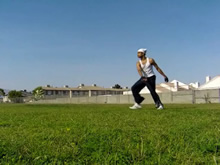 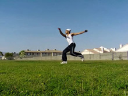 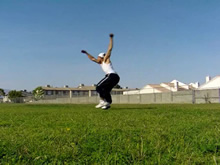

>For a regular vertical jump or other straight jumping tricks...
>
>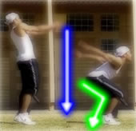
>
><b>You bend (dig) down so you can jump up, so...</b>
>
>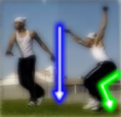
>
><i>You bend down to the ground as you set up, instead of jumping up. This way you can actually jump!</i>

Start by having a little jog going, with the path of the jog being 90 degrees off your target. Basically, you'll be jogging sideways. While doing this though, try to spotting the target, all the way until your feet have dug if possibly. This will help you build a directional sense,and, even for advanced practitioners, help prevent over-cheating.
Prepare your arms in whatever way comes natural for a spin. Usually, this involves lifting them towards the side of the body opposite the spin. It's a very natural motion if you're going to tell yourself to spin in any situation, so just make sure your body knows to do it here.
### Foundational Pop Digging

Proceeding the initial little jog and while prepping the arms, the next two steps (digging and shifting into your stance) happen simultaneously.
First of all, you need to shift into a side-on stance. <b>This is the most important aspect of a Pop Setup</b> from a technical viewpoint and will greatly help the execution of this trick and later Pop variations.
>### The Misconception
>This misconception about the Pop setups can easily lead to over-cheating the setup in later variations and even in the 360 itself.
Many people think that for the setup you're supposed to basically turn behind you. That is to say, that you're supposed to turn away from the target as you setup and then go into it. They say that you should plant your feet facing behind you and then take off into the trick. This is not correct.
><b>Tricks utilizing the Pop Setup use a <u>side-on stance</u></b>. It is not about "facing behind you", or about just turning around or anything. <b>The goal of the Pop Setup is to dig you into a side-on stance</b>. Abandon all of this "turn away from the target in the setup" stuff.

With the side-on stance, both of your feet will be facing <i>approximately</i> 90 degrees off your target. That's right: the same direction you were jogging/walking in. They can be spaced around shoulder width or a little less apart, whatever is most comfortable.

>### Dig Down, Don't Jump Up (Yet)
>Many people, especially beginners, think that to do this setup you have to do a big hop and jump up then stomp on the ground. Well in certain cases that may "work", but usually that relies on the bounce of plyometric flooring or the like. Or, on uncontrolled force pounded desperately into the ground. <i>Don't build your skills on desperation or muscle. Build them on technique.</i>
Not only is jumping up/out into the setup not using the potential of your jumping muscles, but it can also increase your tendency to cheat the setup, especially for higher level pop moves.
So what do you do? <b>Dig down</b>. When you do a standing Back Flip, or even a straight vertical leap: Do you jump up in the air, wait for your feet to come back down and touch the ground, and then try to rebound off the ground somehow? Haha. Not a chance. When you <i>do</i> do a Back Flip or the like, you dig (bend) down towards the ground, bending your legs like you would for any other vertical jump, so you can force them through the ground.
If you look at most good Pop trick practitioners, none of them hop up then try to stomp into the ground. They all dig downwards into their side-on stance as they're moving forwards.
Even good "Poppers" who do take a big hop do it quite low to the ground, <b>they hop into the ground</b>, <i>they don't hop above it</i>. That way, they're legs can coil up, and then later extend!

Now keeping the aforementioned in mind, you can get into your side-on stance any number of ways. Some step into it, one foot and then the other. Some people jump into the ground with two feet at once. Do whatever is most comfortable, this is where your style comes in. Regardless of your style, <i>all that matters is that the essential technical aspects get done</i>, in this case, the four main check points above. Primarily, the two most important: the digging down and aligning the feet.

>Really work on digging into the sideways stance, while spotting your target, and prepping your arms back.

## Pop Setup: Jump

* Jump Straight Up Quickly
* Swing Arms Laterally
* Turn Head to Start Re-Spot

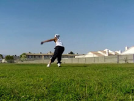 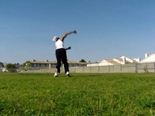

After both your legs have planted, now comes the time to jump! When you do the jump, <b>visualize the flow of the jump going upwards.</b> Don't try leaning towards the side as you jump, or jumping towards a certain direction; push straight DOWN through the ground, and focus the energy of the jump and your entire body straight up in a vertical line. Extend your whole body upwards along this vertical orientation. Thing of pushing the ground, fast, not muscled. Push fast.
As you jump, turn towards your target, beginning to spot the target again. (Technically, the re-spotting of the target is a constant motion that starts in this step and finishes in the next step.) Pull your arms/shoulders over and across your target, so your chest faces the target. Don't leave them down as dead weight.
>### Arms Swing Up vs Swing Around
>This box refers to what direction you're going to swing your arms in as you jump and take off into the trick. Now, you can either focus on throwing them up as you turn, or swinging them around in a circular motion as you turn.
Swinging them up and opening them up is not at all recommended for later variations of pop tricks that involve any spinning. It just, doesn't work very well. It can, in some instances, help in the 360 Kick however. Doing this gives you less "flat spin", or laterally flowing momentum, meaning your rotational velocity won't be as great. In the case of the 360 Kick, this means after you throw your kick, you'll generally not naturally rotate too much afterwards into the landing, and probably be more inclined to land on the kicking leg naturally if you do an outside crescent. Keeping them in guard looks good.
If you focus on swinging them <i>around</i> more, it gives you more of this "flat spin". This is basically required for further pop spinning kick tricks, 720s, 900s, etc. You want to lift your shoulders and such up a little of course, but you want to focus your arms on spinning around you and flowing over and around as you jump. This makes it so, if the rest of the trick technique is done well, you rotate anywhere from 180-270 degrees after the kick comes across into the landing, and your feet usually come together. This looks pretty sexy if I do say so myself haha.
Just keep these little factors in mind, don't worry about them when first learning the move.

>Drilling just up to here helps you be able to takeoff without compromising the dig setup.

## Spot and Kick

* Re-Spot Target
* Optionally Chamber
* Kick Firmly

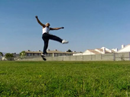 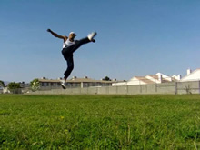 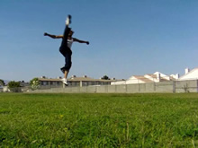

Unlike most other pop tricks, with the 360 Crescent you're going to kick basically immediately after you jump, as you're finishing spotting the target. If you kick too late, your kick will just end up being ugly and incomplete. Although, kick too early and the timing of the trick will be thrown off.
So right after you push into the jump, and you're turning to spot your target, KICK up in the fashion of the outside crescent. To be honest, by the way your body is moving in this trick, the kick basically turns into an outside crescent even if you just kick straight up. So just kick up high into the sky, and fast. ZOOM!
Remember, you're beginning the kick as you look for the target. If you desire, you can chamber for the kick as you spot the target. You don't necessarily need to, especially for beginners just learning. But for this kick many people don't chamber, since it's very simple and easy to do straight-legged. But some people do, and those look pretty good! Do you want to take the time to do this kick with a chamber? You decide! It can look very good either way.
>### Other Kicks
>Most people first learning this trick learn it with a standard outside crescent kick. It is an easy, straight forward kick, and the chamber is optional. However it's possible to do it with things like a front kick (which will resemble a slightly less "rounded", chambered looking 360 Crescent kick), or even a hook kick. A hook kick is used by many martial artists in fact. When done well, it can look very good. If, after getting the tricks technique down solid, you want to try to use another kick, go right ahead. The prerequisite here of course, is being able to do whatever kick you choose technically correct from a stand.

## Finishing Kick

* Bring Kick to Completion

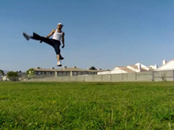 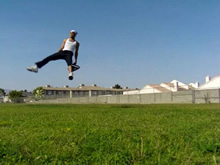

Not much to say here. Pull the kick up and across. It's good to practice outside crescents with much power, so you can really have that kick cut across. That's one indicator of a good 360 crescent, your kick cuts across in a very sharp and speedy arch, SHIING!
>### Why Not Point Your Toes?
>Point your toes as well. This is probably the easiest kick to point your toes on, and it only looks sexy when you point your toes as you kick. If you're <i>just</i> starting to learn this trick and don't have the technique down, don't worry too much about it. But if you can do it and you're practicing making it better, there is almost no excuse not to point your toes on a trick this simple. It helps getting you accustomed to the aesthetic of pointing your toes in general.

## Land

* Keep Spotting to Avoid Extra Spin
* Turn and Re-Spot for Extra Spin

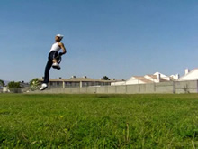 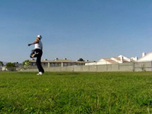 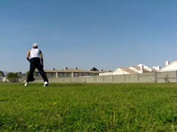

Now just land, this is naturally I don't need to spend much time explaining how to do it. After all, the laws of gravity don't change just because you're doing tricks!
If you're just learning this trick and still have yet to get it down consistently, there's no need to read the box below in this step. You're done! Go and practice it, being mindful of all these tips, and get that technique down!
If you can already do it well and want more landing theory, read on...
>### Differentiating the Landing
>Most beginners land on the non-kicking leg, since they're still getting comfortable with the form. This is fine. When most experienced people do this trick, they either land on the kicking leg or with the feet together. This is a result of a powerful takeoff and good form. The technique of this trick is so simple that "hypering" or over-rotating the trick can start to come natural. This is excellent, but just for the sake of having greater control over your tricks, why not practice landing it both ways?
In fact, once you've really gotten the skill down, there is no technique that can be taught to control the landing. when it comes to hypering or not hypering (without extra spin). Once the kick is finished, you simply have to <b>do</b> what it is you want, you have to tell yourself how to land. There's nothing wrong with just letting yourself go of course, that's fun to do! But if you're training for the sake of controlling the trick, you need to just do and feel what it is you want.
>The "spin out" comes naturally if the jump was fast (powerful) enough and if the vision shifts off the target. To force or expedite extra spin before the landing, simply think of re-spotting the target again by turning before you land on the ground. To avoid extra spin, keep your vision and body focused on your target as you land.

