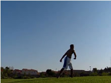

# 540

## Description

The 540 is a huge staple in the tricking world. You'll even see it done in multiple forms of dance occasionally as well. It is basically a Tornado Kick landed on the kicking leg. It carries more power than a Tornado Kick, and it also opens up possibilities for new combinations. Yes, the 540 is a must have; and when done right it can look very smooth and delicious. Plus, it leads on to more lovely variations. You <i>must</i> have a good Tornado Kick for this move. It is completely futile to attempt this trick without a solid Tornado.

## Cheat Setup: Recap

* Perform the Cheat Setup

  

### The Obvious

Alright, this entire step is just going to be the Cheat Setup. I'm going to cover it all briefly in here because I went into it in detail in the Tornado Kick Tutorial. If you want, look back at that tutorial. In fact, I suggest using it to the full if you haven't gotten the full grasp of the Cheat Setup.

Briefly: Pivot around behind you, with only your takeoff foot in about an opposite-side-on stance from the target. While you do that, shift your weight onto that leg that you're going to be jumping off of. Wing up the arms to get ready to rip them up and/or around. Be sure to bend down so you can jump.
### Essential Cheat Setup Power

I'm going to emphasize that last part I just said: bend down so you can jump. That's what you to make sure is happening towards and at the end of your setup. Look at the very last slide, see how the leg I'm going to jump off of is bent, and it's <i>on the ground</i>? That's how you want to be! You want to to bend down onto it as you put your weight on it. Remember, <i>don't think you're bending it by lifting it up off the the ground then sticking it into the ground straight.</i> You can, of course, and should lift it up a little when you do pivot around to dig. But, you want to bend yourself down <i>to the ground</i>, like you would do for any regular vertical jump. Plant your foot in the ground, with your leg like a coil, ready to spring up!

Note this: <b>You can get away with a Tornado Kick if you hardly bend your leg, but a 540 is unforgiving in this regard!</b> Many people wonder why they can't do a 540 even though they can allegedly do a Tornado Kick. The usual result is that their Tornado kick has been "cheating the jump", and they really haven't been digging into the ground. To throw a nice slicing kick that you can land on, you need to maximize your jump potential.
>### "Bend Bend Bend"
>Ok sorry I keep using the term bend or bent. The bend comes naturally from "digging" or coiling down towards the ground, so you can then jump off the ground. It's like a spring! Your leg needs to bend, so your muscles can then pull and extend your leg, which creates lots of force, which creates lots of jump. That's why I keep saying to bend it and such. The concept isn't to be overcomplicated: it's the same principle as bending down when you want to jump regularly.

## Takeoff

* Perform the Tornado Kick Takeoff
* Emphasize the Complete Jump - Quickly
* Swing Arms Around and Up
* Pull Outer Leg Firmly Up

  

>Digging down for this trick is important, especially when learning.
>
>
>
><i>Having our leg bent after we dig before we takeoff...</i>
>
>
>
><b>Let's us extend that leg straight back up, giving us a solid jump!</b>

The takeoff here is similar to how you take off in a Tornado Kick, which is also in my other tutorial. So to recap, turn and spot your target, and pull everything towards your target. Lift your leading (non-kicking) leg up firmly.
Make sure you <b>jump</b>! <i>Don't even think about kicking yet</i>. Push straight down through the ground with your leg, <i>fast</i>, which will shoot you up vertically, giving you enough upwards momentum to be able to cleanly slice the kick through the air and land well. Try to visualize the force of the jump going straight up, vertically, into the sky!
>### High Hips vs Low Hips
>Both the "high hips" and "low hips" versions of the 540 or totally fine. Some people usually do one without even thinking, simply because no matter what you do, if you're doing a 540 right, you're obviously going to end up doing one of these. Basically, the higher hips version is more horizontal. Low hips is typically faster and looks more upright. Both can be done very well, and look very good.
So how do we decide which one to do? Well, other than consciously trying to lift your hips up high as you jump or leaving them down, here are some pointers for getting higher hips. For lower hips, just do the opposite.
>- While you're taking off, lift your leg straight up, in front of you. Don't pull focus on pulling it around sideways as much, just up.
>- Coming out of the setup, throw your arms straight up as the rest of you turns over. Yup, just reach way up with them, don't try to spin them around in a circle as much.
>- Get your upper body slightly behind you as you setup. Lean back a little (this doesn't mean lean downwards, just tilt back slightly), so that when you jump off your weighted leg, and since you're slanted like so, the force of the jump pushes your hips up more. Whereas when your body is more upright, the force pushes not just your hips, but the rest of your body up too.
>### Hooking the Lifting Leg Around
>It's possible when you're doing the takeoff to do more than just lift your leg up or out. You can actually try to lead the heel of your foot around, almost like a pseudo-hook kick. In the example, I lift my leg up straight in front of me, but by hooking it around, you pull it out towards the side as you jump (this works better when doing more of a quickly spinning 540), which can help it bend around under you. Wanna see if it works? Go for it! <i>This isn't so much a technique you can be told to do, it's something you have to feel and simply tell your body to do</i>.

### Pull Up Vs Pull Around

Man this step is long, ok brief brief. When you takeoff, you can focus more on pulling up, or more on pulling over. This is mainly coordinated by the arms. You can think of pulling your arms from bottom to top, or from side to side. You may not want to worry about this at first, and just do whatever is comfortable for you to jump and get the 540 down. But I'd, experiment with them. Trying to pull your arms primarily around in a circle helps for later variations where you have to say...throw another kick out, or spin another rotation. This is because it helps you have more lateral momentum (flat spin) coming out of your takeoff from the cheat setup. The more you just pull your arms upwards, the less (flat spin) you have. But heck, this may be useful for a certain scenario or combo you're doing, or just for control purposes. I say, master them both!

## Chamber Up

* Bend Leg Back for Chamber
* Raise Kicking Knee Upwards

 

>### Importance of Delay
>Do you see how we've pushed off the ground, fully extending the leg quickly to maximize our jumping power before this step? That's good! If we try to kick too early, we end up cutting our jump off, which makes us fall back to the earth...with no upwards velocity. It means we don't jump, just fall. Remember, between the takeoff and the kick of the 540, <i>your body has to do two completely different things with the same leg</i>. It first has to jump with it, a completely independent motion, and then it has to kick with it, also it's own motion. Let it finish both of these steps entirely. Finish the jump, then do the kick. Your body <b>cannot</b> do both motions at the same time.
If you are having problems kicking through the entire arch well, try waiting a little longer after you jump to kick, that can in fact help for people first learning this.

Since we've already jumped, it's time to either kick, or chamber then kick. I always recommend chambering for a faster kick, especially for any inside kick. While you chamber bend your leg in to later be kicked out, and pull your thigh up so you have momentum when you throw the kick. It's actually almost natural for your leg to chamber after you jump. However, the longer you wait to kick, the more it "automatically" wants to chamber. This "auto-chamber" can be both from the legs natural tendency to recoil after the jump just as a second-nature reflexes to chamber the kick. Either way, consciously chambering can always help if your purpose is to juice extra power and speed out of it. Not necessarily essential if you're chambering at all though. Why not practice both?

The heavier (more bent) the chamber, the faster the kick. Thus, for beginners, it's good to try chambering the move hard and then kicking hard. Not only can this help the speed of the kick but also help break a tendency to kick too early.

>Practice doing a powerful Cheat Setup and Takeoff with a fast jump, and then bring your knee up with a chamber. For a little drill: try doing up to this step...but also land on the chambered leg!

## Kick

* Kick to Full Extension
* Optional - Consciously Bend Non-Kicking Leg Back

  

Not much to say here. Kick! Kick to full extension! Contract those quads and extend your leg into the sky!
>### Setting Yourself Up for This
>There's not much to say about the actual kick to help you land. Why? <b>Because, your ability to kick in the 540 is completely reliant on all the steps you've done before this.</b> Get it? You could be able to do the best inside crescent or round kick in the world. But...if you can't set yourself up in a position to throw that kick out, then it iss useless! That's why all the steps that come before this one are equally as important as the kick itself, because doing them well, allows you to kick well. Team work!

>### Other Kicks
>This can of course, be down with an inside crescent, a round, roundhouse, or front kick. Most non-martial artists like myself with use an inside crescent or a roundhouse. Many martial artists can use straight up round kicks. They do look quite sharp! Experiment with different kicks for control and versatility's sake, if you wish.

## Land

* Pull Kicking Leg Into Landing
* Optional - Turn Around and Wrap Into Landing

   

And finally, we've come to this place. Like I talked about in the box before, this step is a result of everything you've done before now. If you already set up well, took off well, and threw your solid kick out, this landing should be in the bag!

However, just to be sure. Pull the kick across. The natural path of the kick will take it to the ground, sweet.
>### Wrapping into the Landing
>You have the choice of wrapping into the landing or not. I say both can look very good. Some people pull the kick across and follow it with their eyes, AND boom spin fast into the landing. They just generally wrap their arms and look over as their kick comes across. I do this in the example, in fact. This creates one type of aesthetic.

So people keep their eyes on the target as long as possible, let the kick come across and down, then at the last second BOOM wrap around and land. That looks awesome! It can also make the kick look more powerful, too. See which one you like. This is one little area in which your own style comes through.

Although, most beginners just land the move facing behind them, since they have just managed to complete the move haha. Just practice it! Get it going nice and fast! When you're doing it well. The kicking leg should come down when you're facing behind you or a little past, and the other leg should come down with you facing the target.

That's all there is to say! There's lots of ways to change this move up, and make it look different. Maybe that's one reason so many people love it. It's fun! Go out and learn it, now!

