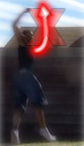

# 720
Pop 720, 720 Crescent/Wheel/Hook

## Description

The 720 Kick is the most basic Pop jump spin kick that actually involves spinning before the kick. You take off the with the two-footed pop setup, jump to face the target, and spin around again to spot the target again, and throw an outside kick (crescent, wheel, or hook) <i>passing through the target</i>, and then land. You can land on both feet at the same time, or on your non-kicking leg. There are 720 degrees of rotation between the starting stance you set up into and the finishing stance you land in.

## Pop Setup

* <i>Execute the Pop Setup</i>
* Plant Feet in a Side On Stance
* Dig Down into the Stance

  

### Setting Up For the Spin

Alright, you can pull off a 360 with an ok setup, but to pull off an <i>actual</i> 720 kick, you're going to really need a solid setup for pop tricks. So let's recap, using what's taught in the 360 tutorial, and adding emphasis to certain areas.

First of all, dig down. Refer to the "Dig Down - Don't Jump Up" section from the 360 Tutorial. Don't think too much about it, you're bending down like you would in a 360 or any other vertical jumping trick.

<b>Pull your arms back</b>. One thing that helps crucially I find is to really wind your arms up, pull them back and hold them back <i>until you have completely digging and are ready to jump</i>. Not only will this give you lots of torque for the flat spin as you jump, but it will also assist in keeping you from cheating too much.
Identically to the 360 kick, you want to be moving in a straight path about 90 degrees off the target. Spot the target as you dig. Wind it up! On your finally step(s) into the setup, make sure you bend down, arms wound up, into your side-on stance.
>### Preventing Over-Cheating
>Ahh yes, to make everyone happy, and yourself, you want to try to cheat as little as possible. Preferably, not at all. This becomes hard when you do the setup and you turn behind you (facing away from the target) as you dig. (Reference "The Misconception" from the 360 tutorial). Or, even worse, if you jump into the setup while turning behind you, you can end up cheating a looot degrees like that haha. To avoid over-cheating, there is basically one essential thing to do: dig into your side-on stance. I emphasis this heavily in Dig step of the 360 tutoial. Getting into your side-on stance and digging into it is absolutely essential. None of this turn around behind you and then wildly jumping into the spin. Control the setup, dig into the stance. Don't anticipate the spin, don't start the spin while you're setting up, <b>only</b> focus on getting into the stance, <u>side-on</u>.

Try to stay aligned upright during this; don't lean outwards while digging. Try to keep your head at it's neutral (neutral relative to the ground, not relative to your body's alignment) while digging. Basically, try to keep your chin up and parallel to the ground.

## Pop Spin Takeoff

* Torque Arms Around
* Jump Quickly Straight Up
* Start Re-Spotting the Target
* Don't Wrap Yet

  

><i>Don't try to reaching up to the sky you jump, that kills your takeoff flat spin...</i>
>
>
>
>Instead...
>
>
>
><b>Swing your arms <u>around</u> as your <i>legs push you up</i>, to get a powerful jump along with a powerful flatspin.</b>

Now comes the takeoff. Here's something really important to remember: <b>we're going to jump into a flat spin</b>, <i>we're not going to jump into the spin that's going to take us all the way around</i> through the entire trick up to the kick.
Do not begin this step until you have finished setting up and your feet are firmly planted on the ground. There is but a split second between the digging setup and the takeoff. It's like a rebound off the ground.

Jump up, jump straight up, push through the ground with your legs. Don't try to muscle it, just try to do it fast, which will in turn be more powerful than focusing on forcing it. Don't jump in a slanted direction, tell yourself to jump straight up.
As you're doing this, tuuurn towards the front. Turn hard. You want to turn and spot your target. However, moreso than just turning to face it, pull past it. You want to torque your arms <i>around</i>. Do <b>not</b> wrap them in yet though, just pull them straight around in that circular motion. Keep the those arms and shoulders open so you can wrap in in the next step.
### Around, Not Up

Really emphasize the swing of the arms around. Do you remember how in the last step I told you to hold your arms way back behind you? That helps a lot when it comes to the swing, because they have more room to cover. So swing them through all that space fast; just as you jump fast, do this all fast! Keep them open as you swing up too, because the longer your arms are as you turn into the flat spin, the more rotational force you generate. Not to mention that just torquing them hard generates lots of force too, haha.

Don't get confused: you still want to focus your legs to jump straight up, and you still want to raise your arms/shoulders up a little. But you don't want to <i>swing</i> them upwards, k?
For the longest time, I never could do any pop spinning tricks because I'd always throw my arms up as I turned towards the front! And I don't mean I'd just lift them up, they'd go flying upwards haha, like I was reaching into the sky. Do not do this! Spin them AROUND. It's moreso important that that's what you're <i>feeling</i> and not as much what you look like. You have to just do it it's another one of those things that's not exactly a technique that can just be taught. Most people who are good at these don't lift their arms up much at all, they mostly just coil them around, but do whatever is comfortable for you and allows you to spin.

## Flat Spin

* Keep Pulling the Flat Spin
* Don't Wrap Until Off the Ground
* Spot Target Quickly

 

This is the spin coming off the ground, the infamous "flat spin". This is going to be complimented with our mid-air spin in the next step. So why is this step here? I dunno! I guess I didn't want to many slides on the same step, haha. Actually, you want to finish the torque from the previous step with your arms here. Of course, you don't want to totally stop the torque, because it's going to flow into your twist. The flat spinning torque starts in the last step and continues into this step. The actually wrapping spin isn't going to start until the next step, and it's going to flow from the current torque.

You want to spot your target as you jump and leave the ground, for but a split second. You want to keep pulling hard past your target with your whole body still. It's like a dancer doing pirouettes (for the dance-illiterate, those one-footed spinning thingies). Their bodies keep on spinning but their heads spot between each turn. So let your body spin into the flat spin. But, spot as you're coming up, briefly, and then in the next step we're going to snap it around and re-spot the target. You generally want to torque into the flat spin from the takeoff powerfully and fast; that way, you can instantly flow right into the wrap. If you don't do all these steps fast and in quick succession, then you have to delay the wrapping spin more and blah blah all this stuff that can break down the flow.

So pull the flat spin past your target, don't stop spinning after you face your target, but also <i>don't rely on the flat spin coming off the ground</i> to get you all the way around the whole trick. The flat spin is <b>essential</b>, but it's not the only essential part...and that's why it's not what makes you spin the entire way around in the trick.

>Work on doing the Pop Setup then taking off into a firm flat spin. Remember, when drilling up to this step don't wrap for the full spin. However, your flat spin in itself should take you almost all the way around anyways.

## Twist

* Wrap and Pull Arms and Shoulders
* Turn Head and Start Re-Spotting

  

WRAP! WRAP WRAP WRAP! TWIST! TURN! SPIN! Remember how I asked you to torque into that flat spin really hard, but keep your arms relatively open and wound up? Well, that's what brings us to this place, this oh so great place. We're just off the ground; we have lots of flat spin; and we're ready to go. So now, do the actual spin. Wrap your arms in tight and spin around, turn your head around and start re-spotting your target. Really focus on looking firmly at the target again. Don't lean towards whatever direction you're spinning either, this is a pure vertical spin. Just zooom spin around again in the air.

Keep in mind, once again, that the flat spin coming off the ground and this spin in the air are two completely different motions, and you should commit to each motion separately. However, they should <i>flow together</i>. As you turn into the flat spin with your arms open, you should then be able to wrap those open arms into the twist, adding on to the power of the flat spin. Awesome!

>### Avoiding Kick Confusion
>Ahhh, this is a problem you may have when first learning it, OR, after learning higher variations like Pop 900's. In those, you land on the leg you kick with for a 720, so your body may get confused, and thus choke on your 720. This has happened to me yes.
>
>There are a few things that help. One, is to break this trick down to it's basic steps, and do those. However, your body may just feel natural at this point to try to land on the kicking leg, in anticipation of throwing out a kick with the other legs. Dang you muscle memory and 900s! So try to visualize 720s and 900s as two totally different moves.
>
>Also, <i>remember that you want to pivot around your non-kicking leg</i>. Really think about that when you do this, if you have this problem anyways. You don't want to shift your rotation over to your kicking leg. Keep on rotating around the non-kicking leg, because after all, if you're instead rotating around your kicking leg, how are you going to kick it out without DEATH?
>
>Of course, the axis you rotate around runs right down the middle of your body. But, since you're going to land on one leg and kick the other out, you're going to have to shift onto one side or the other...

>Now onto your flat spin from the last drill, just add a wrap! For the drill you want to practice: 1) balancing, 2) not wrapping before you leave the ground (timing), and 3) being able to face the target again with a full rotation upon landing.

## Kick Prep

* Start Spotting the Target
* Prepare the Kick by Chambering

 

Yet another somewhat unnecessary step. This comes naturally, get ready to kick. Most people chamber for the kick. I'd say, when first learning don't focus too much on preparing the chamber in the air all nice and pretty and such, just focus on spotting your dang target and kicking it. Let the chamber come naturally when first learning. If you've practicing chambering your basic kicks on the ground, it should transition well into chamber by second nature in the air.
Oh yea, look for your target. Keep that spin going around, look over your shoulder, and pull your shoulders, arms, elbows, all that to the target too.

## Kick

* Extend the Kick
* Allow Spin to "Open", or Stop

  

Tada, here comes the kick! Just uhh, kick at the target! How well you kick here all depends on how well you did all the previous steps. If you didn't dig, set, turn, and spin well, your kick will not come out well. So yea, in this step, just kick!
Also, keep either of your arms from lagging behind you. I have a tendency to do this with my back arm, so in this video I had to keep pulling it forwards. Try to pull them towards the target, although in this video I should be trying to get them farther towards the target anyways. That would make the crescent-type kick look better. Or, I could have hooked the kick to make it look better with the direction my chest is facing and all that, but whatever haha. I'll keep working on pulling my shoulders/chest around further to the front as I kick, and when I can do that very well, I'll update the slides, but it's acceptable for now. Here's the important thing:
<b>The kick passes THROUGH the target</b>! I see it SOOOO much: The kick comes scraping along the bottom, or it kicks up 45 or so degrees off the target then drags down across. Forget that! It does NOT count unless the kick actually completes the full kicking arch and goes through the target, just like you would with a standard spinning kick. This holds ESPECIALLY true if you're crescent-ing the kick to any extent, even for hybridish kick. Well, even if you hook the kick, it should <i>still</i> pass through the target when the kick is at it's peak. Seriously, so many people worry about not cheating the setup too much, but don't worry about actually completing the full rotation and the full kick.
Again, the ability to kick through the entire path is dependent on how well you did the previous steps. But really, I implore you to have a good kick that goes up and through the target <i>at the peak of the kick</i>. To everyone who does 720s like that, you rock!

## Land

* Land in back in the Pop Stance

  

A natural landing now. Just let the kick complete it's arch, and come out of the landing. How do you know that you did this trick well? You land in the same stance you dug into at the beginning of the trick! That's why it's called a 720, there are two full rotations between the stance you setup into and the stance you land in. That's why it's essential to set up into the proper stance. And, if you've done the technique right, once both your feet land on the ground, you will be in the same directional stance you were in at the first.

That said, there's not much to think about for the landing, it's very natural, and if you do the trick well, will feel very satisfying. If you're just learning this, you'll most likely land on one leg. If you get a very speedy kick going, you might land on too legs, or even unintentionally hyper. Being able to land on two legs automatically makes it easy to hyper, and it's a hyper that you don't have to force.
Well, that's all kids! Have fun with this trick.

