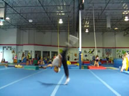

# Aerial
Free Cartwheel, No Handed Cartwheel

## Description

The Aerial is a trick used in gymnastics, Martial Arts, dance, cheer...everything! It is a cartwheel, but without the hands touching the ground. Essential, it's jumping from one foot onto the other foot with the body moving in the same fashion as cartwheel. There are many variations of the Aerial. Due to how easy and quick it is, there are also many combo possibilities with it.

It is said that there are two types of Aerial. A "Martial Arts" aerial, and a "Gymnastic" aerial. In reality, there is only one type of Aerial. That is the "Correct" Aerial. There is one fundamental Aerial technique, but there are many different styles of it. We are only going to focus on the fundamental mechanics of the Aerial. There are dozens of small idiosyncrasies and tweaks you can make. But, as long as the foundational technique is there, it will still be an Aerial.
Start this move, not with a run, not with a jog, but with a walk forwards. One thing to keep in mind as well: Timing is the most important thing when learning this move.

## Dip

* Step Your Leading Foot Out
* Dip Your Upper Body Down
* Open Up Arms, Keep Chin Up
* Bend Down Over Leading Leg

  

After you've taken however many steps you're comfortable with, step forward with the foot you're going to jump off of. Allow the rest of your body to come with it, as you can see in the picture. As you finish stepping forwards, bend down over your jumping leg. Why?

The Aerial is a jump. If you were to get up from the computer (where I'm assuming you're reading this), go to a small open space, and jump, what would you do? You would bend down, and then, just like a spring, jump upwards. You must do the same with the Aerial.

It is essential that you come down here. The absolute, most common mistake people make when trying to learn the Aerial, is coming down later. Don't think that you're going to throw your upper body down and kick up and do some sort of ridiculous wheel in the air. Your upper body comes down here, not as momentum for the rotation of the Aerial, but as preparation for a jump.
### Spread the Legs

Since the Aerial is a move that is done off of one leg, obviously you're going to want to shift your weight over onto one leg. This is the leg you have in front of course. Moving your leg further in front of you helps with this, especially from the "straight line" take offs. This is <em>not</em> blocking, not by any means. It's just making it so that when you jump, the angle between your foot and your hips is closer to vertical. That's the angle that the force of the jump is going to go. Some will still assert that this is blocking, which is directly transferring horizontal momentum into vertical momentum. This is false, and I would invite anyone who is convicted that this is blocking to prove this case.
Once you finish this step, your jumping leg should be bent enough to jump off of. Look at how it is in the picture. If your leg is straight when you try to jump, your muscle are not going to be able to extend. No extension, no force, no jump. No Aerial.
### Things to Avoid

Look at my setup here, nice calm and easy. Man beginners try to force the trick by running into it. Or leaping into it. They may kick their leading leg way up high, then stomp down into the setup. Haha, don't do it. It may feel powerful while you're doing it, but it is not. Stop doing it. By putting that much unnecessary force into it, your going to rush things. Then you won't be able to control the timing of the technique. Go into it more calmly. Your feet should always stay low to the ground, as if you're walking. Look at how I do it in the video. Do not rush it. And if you are trying to learn the Aerial by running or skipping or leaping into it during your setup, don't ignore this advice.
Really, do you do any of those things before you do a regular jump? No, you'd just be throwing yourself off if you were to do those things. Approach this setup here just as controlled as you would a regular jump.

>### Side to Side Confusion
>Here, I teach the Aerial in a setup that involves walking along a straight line. You can go into an Aerial from the side, in a sense. Your leading foot should always face the same direction you're traveling, regardless of the set up. Even if you do the setup side-to-side, you must still dip down in this same fashion. It's still a jump, after all.

Take note of where the back leg is right now.  It is still on the ground. Sometimes people kick that leg up as they dip down. Perhaps they're thinking that their going to create some sort of ridiculous rotating momentum by pivoting their body like this. This doesn't work, you'll just throw yourself into the ground. Keep that back leg on the ground until you jump, which is the next step.

## Take Off

* Jump Off Leading Leg
* Swing Back Leg Straight Back
* Lift Arms Up
* Keep Looking Forwards

  

A few different motions happen at the same time during the take off.
To put it simply: Jump off of the front leg, kick the back leg up straight behind you, keep your chest up, swing your arms up.
Do this all fast.
<b>Do not:</b> swing your head down, swing your chest down, swing your arms down, or do anything that you think is going to make you spin faster. Your body does not spin around like a wheel in an Aerial. You jump up and your legs stretch over head. Fight the intuitive urge to throw that upper body towards the ground.
>### Cartwheel: Making You or Breaking You?
>This is where the Cartwheel might hurt you. Timing is important in the Aerial. Timing is not as important in a Cartwheel. In an Aerial, you <em>must</em> dip down as you setup, and then you <em>must</em> kick your leg backwards as you jump. In a Cartwheel, the timing of these doesn't matter: as long as your hands touch the ground and the legs come up, you're good. So the timing of the Cartwheel may make you want to touch the ground when you Aerial.
This means that, while still essential, your prerequisite, the Cartwheel, can throw off your timing. Your muscle memory will be used to doing things at a different rhythm. But, that also means your Cartwheel can help you. You can work on changing your Cartwheel, so that you time the motions the way you need to for an Aerial. If you practice that, and get that into your muscle memory, perhaps the Aerial will become a little easier for you.

### Arm Motions

There are so many different arm motions you could do during the takeoff that it's unnecessary to talk about them all. Why? Because all of them are fine as long as they keep you up.
Don't let your arms hang as dead weight. Don't stretch both of your arms back behind you as you would a B-Kick. Your front arm should simply raise <i>forward</i> in whatever way is comfortable, and your back arm should swing up in whatever way is comfortable. Whatever motion comes natural to you to get those things done is up to you. Sometimes it helps to lead the arm motions with your elbows.
>### Jump Travels Forwards, Not Up?
>When doing an Aerial, we focus on jumping straight up. Just like a vertical jump. Why, then, does our upper body stay low, the legs travel overhead, and the whole body move forwards? Why doesn't it all go straight up like a normal vertical jump?
>
>We dipped down in the last step so that our head was lowered and in front. But, as we jump now, our foot is still directly under our hips, vertically. So, since our upper body is "out of the way", your hips get pushed up by the force of the jump, instead of your head. This means your hips will travel around your center of gravity, which is now in front of them thanks to the placement of your upper body, meaning an Aerial!

Try to keep your chin up here, it may help to fix your eyes on something in front of you. Whatever you do, do not lower yourself any further during this takeoff. Do not swing down at all. As mentioned in the previous step, sometimes people lower their upper body as they swing their back leg backwards. This is not a lever, and your jumping leg is not a fulcrum. The back leg swings back, that is where we get the rotation from. We do not get any rotation from our upper body dipping, so don't try to, please.
>### The Side to Side Illusion
>While it's possible to do an Aerial from a side-to-side looking setup, the Aerial is not in itself a side-to-side move, like a Side Flip. Why does it look that way then? Because you're kicking a leg back up <em>while your upper body pivots over to the other side</em>. Therefore, your body covers a subtle half a rotation while the legs fly over head. Your head and feet go from facing one direction in the beginning, to facing the opposite direction in the end. Between these two points, your body appears to be facing sideways since the legs are spread out. Your feet can still face forwards even if your chest faces the side. This isn't very important, but it's just good to know why some might mistakenly think this is a "side-to-side" move when looking at it superficially. Oh yea, shoulders and head torque is primarily responsible for the turning of the body. You do not lift your leg sideways, it merely looks that way since you're turning.

>Practice just jumping. No flipping, no spinning, no Aerialing yet. For now drill doing the setup and jumping. Lots of people don't jump when trying the Aerial, and they can't land it. So, practice doing the Aerial setup, and then just jumping. Get used to that motion. If you still have trouble doing the Aerial, do this. Seriously, do it. I tell people to do this all the time. But for some reason, they think that they can keep doing the same thing they're doing and get different results. That's crazy. Slow down, stop, listen to the experience of others: try this drill if you're having trouble. Do it many times.

## Pull Around

* Keep Legs Extended
* Kick Front Leg Straight Down

 

From here, it's simple. Look forwards, and then pull your foot down in front. It's as if you're just kicking it straight down under you. The faster you can kick it down, the better. You don't have to hold your body up here, mostly because it's physically impossible. Your body will <em>stay</em> up if, and only if, you did the Setup and Take Off properly. If you keep falling here, or if you keep not being able to make it here because your hands touch the ground, your timing is incorrect in the previous step. Try the drill mentioned after the last step.
If you keep putting your handles of the ground, let me remove any curiosity as to the reason: you are not jumping up at the right time. You are also probably dipping your body towards the ground as you jump, instead of before you jump. Work the setup slowly, and fix that timing.
### Simplifying the Concept

An Aerial is basically jumping off one leg and landing on the other. So, if your leg is is up behind you in the air, what do you need to do now? Simply start pulling it back down. Lead the pull with the front of your foot. Do not try pulling it down sideways, as we talked about before, this is not a side-to-side move. It is a back and forth move. So don't pull your leg sideways, pull it forwards.
>### Extra Theory
>The Aerial is incredibly easy if we expand on that concept. Most beginners over-complicate it, and go out and try whipping themselves down into an awkward leaping cartwheel. You're just doing a Cartwheel while jumping from one foot to the other. Keep that in mind. While you're doing the previous steps, ask yourself: am I trying to jump from one foot onto the other? Or am I trying to whip myself down in order to rotate around for the Aerial?

## Land

* Land One Foot at a Time

  

And pull your leg down to the landing, easy! Land one leg at a time. Very sweet! Since you're moving forwards, your legs come down into the landing quite naturally anyways. Yup, that's the Aerial! Go go go! Try it!

