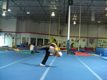

# Axe2Aerial
Swing-Thru Aerial

## Description

This is a pretty nifty trick to have. You just kick your leg up in front of you (in Axe kick esque manner), then swing it down into an Aerial. The leg you swing down from the Axe is the same leg you swing up behind you for the Aerial. That's basically all there is too it. Some people struggle with this a lot when first learning, I sure did. But if you just get your head around a few concepts, it's easy.
The prerequisite is an Aerial, but keep in mind, it has to be a good, proper Aerial. It should go in a straight line, and you should be able to take off facing forwards, and land with your foot facing the way you came. Alright? Let us begin.

## Axe Up

* Kick Your Leg Up Moderately
* Prepare Arms Naturally

 

Take a step forwards or whatever and kick your leg up like an Axe kick. You don't have to do an actual emphasized Axe kick if you don't want, but make sure it's straight and lifted up at least around your stomach/chest level, although even your hip level will do.
It might help if you lean towards your Axe as you kick it up, but that's optional. I'll talk about stuff related to this in the next step...

## Swing and Dip

* Swing Down Firmly
* Dip Down Quickly

 

From here, swing your leg back behind you, hard! And swing it down around in a circular motion. As you do this, dip down and lean out forwards, like you do in the setup/dip for an Aerial.
### Don't Forget to Dip Here

This is the biggest thing that troubled me when I first learned this move. I kept falling and dying when I jumped into the trick. Why? Because I was dipping late, as I was jumping. No! Just like you dip before you jump into an Aerial, you need to dip before you jump into this trick. Just because you're swinging your leg doesn't make this different. Because as soon as your leg passes your planted foot, it's time to jump. And you don't want to have to dip down from the top when you start to jump, so dip as you swing down.

## Aerial Takeoff

* Continue the Axe into an Aerial Swing
* Jump Firmly
* Swing Arms Up

  

Now keep pulling that leg that you swung back even more back, way back up and around. This is the same takeoff for an Aerial, it's just that instead of lifting your leg from a stand, you swung it from the front to the back. So there's not much to say here. Remember, <b>don't dip down during your takeoff</b>. This is very important. You should have dipped down and leaned forwards prior to this step. Now, just keep your upper body up and reach forwards. Pull your arms up, do everything like an Aerial, etc.
### Keep Falling

If you're falling, you are trying to dip down during this step. This can be a hard habit to break. What I would recommend is focusing on doing something in the preceding step: lean in towards your kick as you kick up, and consciously lean forwards more as you swing down. Just as with an Aerial, there should be no more dipping happening in <i>this</i> step. It's a logical sequence of events: dip > jump. So, don't lean down at this point in the trick whatsoever.

## Aerial Completion

* Complete the Aerial Technique

    

I guess I should put something here, but I just don't know what, mwahah! This is identical to an Aerial! The only thing that changes in this whole trick is the way you set up. And the only important thing to remember there is to dip as you swing down so you can jump when you're swinging up behind you. Continue the Aerial, dig into the landing. The momentum from swinging your leg actually helps this part go faster and smoother.

>### Further Extensions
>You might want to actually think less of this move as it's one entire move, "the Axe-2-Aerial", and more of it like an Aerial preceded by a transition. In this basic demonstrate, we use a straight axe. But there are a multitude of other kicks we can use. Inside crescents, sometimes outside crescents, front kicks, round kicks, etc. And sometimes you'll have to pivot towards a certain direction to Aerial, not just going straight. There's a plethora of things to do with this Swing Through technique. So the point isn't just to teach you how to "Axe-2-Aerial", it's to teach you how to swing back into an Aerial so you can apply this concept to many other instances where your leg will be up in a swing-able position.

And that's all for this move, just land as you would an Aerial. This move isn't too hard if you figure out how to make the setup and takeoff work together. Go try it, it's easy! Have fun.

