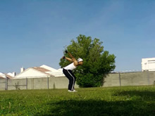
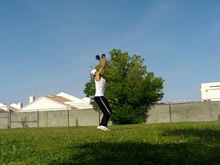
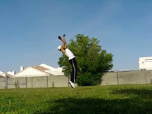
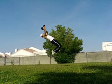
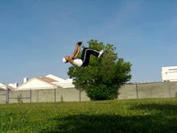
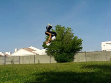
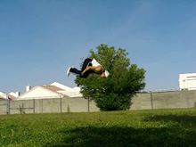
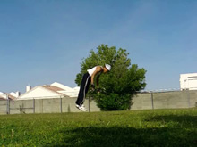
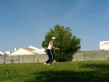

# Back Flip
Back Tuck

## Description

The Back Flip is a universally recognized and respected trick. It involves jumping, flipping around backwards, and landing. The flipping is usually generated by a tuck after the jump. For example, the proper gymnastics version, a Back Tuck, always features a tuck. The move is not extremely difficult, but it is very scary for beginners. The only truly difficult aspect of this trick is the fear. With the fear gone, the rest of the technique is possible. If the fear is there, your body's reflexes will compromise the technique. So let's discuss the technique as well as the fear.

## Dip

* Bend Down with Your Legs
* Pull Arms Back to Prepare for Jump

  

In any other situation, what do you do before you jump straight upward? You dip down. So, before a back flip, you dig down in same fashion. Pull your arms back a little, so you have room to swing them forward. Don't over-complicate this.

Remember, you want to jump up like a spring! A spring coils before it can jump. This step is the coil.

## Jump

* Jump Up
* Swing Arms Far Up
* Keep Head Neutral
* <i>Don't Whip Backwards</i>

 

Jump straight up. Pretend like you're trying to do your highest vertical leap. In fact, do your highest vertical leap a few times, to get a feel for what you need to do.

Don't try leaning back, and definitely don't tilt your head backward. Don't tilt anything down. Remember, you're going to bring your hips up over your head, not bring your head down under your hips.
You may ask, if we're not trying to lean back, how do we get a little momentum to go backwards at all? Why does the set for a back flip look different from a regular vertical jump, if we're trying to make it feel like a vertical jump?

If you notice in the picture, the arms swing very far up, pull the shoulders back a little. So remember, you don't need to <i>lean</i> back, but you want your shoulders to go backwards. In my case, swinging my arms back helps me do this. Some people shift their shoulders back without that. For a beginner, the full swing may help though, especially if you want to differentiate it from your vertical jumps.
### Leaning Back?

If you consciously try to lean back, you will most likely cut your jump short. Remember, if you're leaning backwards, your head is going down. Let's think about it. If part of you is leaning downwards, but the other part of you is leaning upwards, you have two contradicting motions, don't you? That means your jump will not be nearly as high as it could be.
>### Accidentally Traveling forwards?
>Some people travel forwards unintentionally when they back flip. This is usually caused by leaving the ground when your shoulders are still in front of your feet. Doesn't that make sense? If your shoulders are forward (and subsequently your upper body is forward a little), the direction of your jump will be slightly foward..

Try to keep your head neutral. Look in front of you for as long as possible. That will keep your from whipping your head back. And one of the most important things: <b>jump fast, not with force</b>. The Back Flip does not take any more jumping energy than a regular jump, but many beginners intuitively think that it does. Worst, many people think you can jump higher, or have more jumping energy, by trying to muscle the jump. When trying to do something powerfully, do not ever think of "muscling" it, or trying to put a lot of force into it. If you do something fast, that will make it powerfully. So jump fast in this jump. Don't force it, just try to get off the ground as quickly as possible.

>Get used to that jump and set! Actually, there's a plethora of other drills to get used to setting the Back Flip, find one that works for you, if you so desire.

## Note on Fear

I'm interjecting my note on fear here because after this is where that reflexive fear will start hurting you. And I'm going to say there's a whole lot of different drills you can do to help alleviate fear, or get your body to stop reflexively choking when it goes for the trick. Practicing back rolls, rolling backwards off a bed, jumping and tucking your legs up with your back against something, going into a bridge backwards...there's no complete list really. <i>Anything</i> that you can do to help, any sort of drill or exercise to get your body aware of itself enough to flip backwards, is possible.

To that end, this tutorial is only really going to teach the technique. The Back Flip technique is very easy, most people have the physical capability of doing it quite easily. The hard part, and the part that takes probably 90% of the time when learning to Back Flip for some people, is just getting over the fear, and that's not something that you can teach a consistent technique for.

Keep in mind though, that the fear for things like a Back Flip, that makes you keep turning to the side, or falling apart mid-air, or whatever, is not actually <i>being afraid</i>. It may be that way after a while, but after you've been trying it for weeks and you still can't do it, it's just your body's reflexes. Yes, your body doesn't recognize the Back Flip's movement as natural or safe, so, like any other reflex, it's going to try to stop it when it happens. And the more this reflex happens, the more second nature it becomes to fail.

This is why, if you have this problem, lots and lots of drilling of little exercises or fear alleviating techniques is necessary. You have to completely train your body to be comfortable with going backwards. You either need huge drastic changes in the visualization of the flip, or a LOT of little changes built up that affect your body's awareness. Don't be disconcerted if you can't get over the "fear" in a short amount of time. Just keep practicing whatever awareness exercises you're doing.

## Tuck Around

* Tuck Legs In
* Bring Knees Up Towards Head
* Tilt Head and Back Backwards
* Tell Your Body to Flip Backwards

  

Now that our feet have left the ground, we can flip backwards. This is the good part!

This is easier if you focus your jump energy straight up in the past step. Your legs bend in under you almost by habit, so now you want to take that natural bend and amplify it by squeezing your legs together, folding them in, and bringing your knees up to your chest. Of course this motion isn't merely lifting your legs up to your chest. To compliment the pulling of your knees up, pull your hips up as a whole. Tucking makes this much easier. Really pull your hips up along with your knees and your entire lower anatomy, swish! Because in actually, it's the hips that make you rotate, not just your legs. Your hips are the lower part of your core, and therefore when you pull them, they put rotation on the body as a whole. Tucking your legs merely (extremely) helps the hips get up.

At this point, you might also want to try pulling your back around, and even spotting the ground back behind you.
>### Turning to the Side
>If you're turning to the side, read the above step. It's a result of reflexive fear. Even if you know to keep your head straight, and you tell yourself to tilt your head straight backwards to spot the ground, your body may have a totally different agenda. Training is required!

Since we're in the air, we can lean back as much as we feel like it. It's best not to try to focus our energy backwards with your upper body until the tuck of the legs is reaching it's peak. If you lean back in the air too early, your tuck will be incomplete, and have to keep trying to rush towards your chest as you spin around, leading to a low and possibly dangerous landing.

## Open and Drop

* Open Up Tuck
* Land with Feet Under You

  

This part isn't too hard. After you've pulled yourself around in a circle, extend your legs back out below you to land high. When you're just getting to this step, you might want to keep them tucked in a tad, just to get over the fear of landing firmly. But from here you can generally just "open up" your body and let yourself fall out weeee. This part doesn't take much though, the thing that will distinguish whether or not you can do this step well is if the steps you did before this one were firm, strong, and confident.

That's basically all there is to this move. Yay! Try it out!

