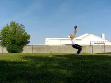

# Back Handspring

## Description

A Back Handspring is a flip done by leaning and arching back and pushing off the ground with your feet and then with your arms. You sort of flip backwards onto your hands then your feet, all in just about one continuous motion, although it can be broken down into the motions of jumping and arching back onto your hands and the motion of swinging your legs over and pushing off with your hands.

<b>Different than a Back Walkover?</b>
In a Back Walkover, you simply walk over (backwards, tricky tricky) with your legs and back instead of just boom flipping over. Your legs also spread as you go back. It's more like, leaning backwards into a bridge, and then stepping over, rather than trying to flip over.

## Bend Down

* Dip Down In Preparation for the Jump
* Swing Arms Back To Gather Momentum

 

Alright, for the Back Handspring, bend down at first! Simple enough. For the Back Handspring, bend down a lot actually. Get your arms behind you, ready to swing up. Simple enough.

## Push Back

* Push With and Extend Legs
* Swing Arms Around and Up
* Look Backwards Towards the Ground

  

Now here comes the "hard part." Pushing back into the Back Handspring. What you want to do is push backwards. Think of leaping backwards, not to high, not to low. See, this is a high contrast from what I usually say in tutorials haha. Since you're trying to stay low to the ground and touch your hands on the ground in this move, you want to actually leeean back and push backwards, alright?
And, arch back! This is essential to be able to do a Back Handspring properly. Think of trying to look back at the ground behind you. Do it hard and fast, as you're pushing back. Don't throw yourself into the ground though, just push right towards behind you.

This motion is primarily led with the arms, so really swing and extend those arms. One common problem that individuals first learning have is not leading with their arms. Get a full swing with those arms going, don't leave them behind whatsoever, or you'll fall!

## The Fear of Going Backwards

Ahh, this is scary stuff for a beginner! How do you go backwards without breaking your neck? Well to be honest, breaking your neck is not at all easy. To be honest, for things like the Back Handspring, it's even harder! Why? Because you're arching backwards, I mean, you're trying to look at the ground. This way, when you curl and arch over, you basically see the ground, so it's impossible to to fall and break yourself. Seriously, it's just not that hard.
I also talk about fear differently in the Back Flip tutorial, check that out as well if you need more information on it.
### Drills

Here's a drill to help get over the fear of flipping backwards for ya: do all the steps in this tutorial, but instead of jumping back, jump UP! Like, jump hecka high upwards, like a vertical jump, as high as you can. And as you do this, arch back. No, I don't mean lean back or jump back, I mean, arch your head backwards, and try to look as hard as you can at the ground beneath you backwards. This will arch your back, and flip you around. You can do this and land on your hands and feet, or on your feet, or whatever. Catching yourself with your hands might be easier.

You might be saying "oooh this is gonna teach bad form" "oh man thats not how you back flip" etc etc. Oh well, I don't care at this. This little tidbit isn't teaching you how to Back Flip or Back Handspring; it's teaching you how to get over the fear of flipping backwards. If you can get over that fear, then you can learn good technique on your backwards flipping tricks all you want. Do this drill a lot until you are totally comfortable with going backwards.

## Reach Back

* Keeping "Looking For" The Ground
* Reach Extended Arms to Ground

Look for the ground with your eyes and your head, arch your head back. And, lead your arms back to the spot you're trying to look too.
Remember, unlike most jumping moves, you want to lean back into it and reach for the ground. So do so! Reach backwards! At this point, the lowness to the ground and arch you've developed mostly comes to what you've done before now haha. So just, reach your hands to the ground, making sure you can see with your head where you're leading them. It's quite naturally from here.

## Pivot Over

* Plant Arms Firmly On Ground
* Bring Legs Straight Over Head

  

Now that your hands are on the ground, you can easily pivot your body however you want. Your legs should be behind you, so guide them down behind you. Try to keep them straight, that's good form of course. But when you're first beginning, don't worry too much about it.
...There's really not that much to say about it haha.
### Where to Pull Your Legs To

It depends on your goal! Are you just trying to do one? Then heck just fall out of it. Are you trying to block into another move that goes up in the air, like a Back Flip, Full Twist, Flash Kick, etc, then try to push your legs out far behind you, and push with your arms.
If you want to go into another Back Handspring or something, try to pull your legs relatively close to you, like I do in the example!
### Straight Arms or Bent Arms

No matter what anyone says, keeping your arms straight in a Back Handspring, or in whatever sort of tumbling pass ground-touching maneuver, always keep your arms straight so you can gain maximum distance as you travel through the move.

## Land

* Bring Legs Complete to Ground
* Let Hands Come Off Ground
* Optionally Push With Arms

Tada! You land! Yippee! Not much to say here...

### Into Continuation

Ok, if you want to continue your Back Handsprings, is usually best to let your legs bend in a little. Not too much, but a little. This helps get your legs under you, so you can jump backwards, and not so much up on this one. It can also give you the ability to push with your legs into the next Back Handspring.
>### To Bend or Not to Bend
>Some may say you shouldn't bend your legs down. Maybe that is so. Well, if you do one Back Handspring from a stand, you don't already have that much momentum, so you can bend them if you want. But, if you've been doing a lot of Back Handsprings, and/or you already have a lot of momentum, I suggest keeping them straight!

## Continuation

* Repeat the Process Like You Started It

 

Ok, if you look at the first slide in this step, it's almost completely identical to the second slide of the second step. What does this mean! From this position, just do the same thing you did in the previous steps. A natural continuation! Wooo hoo!

Do it! Have fun.

