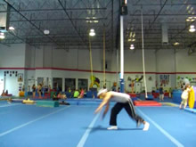
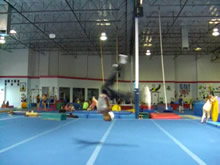

# Brandy
No-Handed Roundoff

## Description

A Brandy is a pretty simple, fun, and powerful Aerial variation. It's an Aerial landed on two feet. It's basically identical to a no-handed Roundoff. What more is there to say? It's useful to learn to progress to the Aerial Switch, and can also be quite useful in tumbling combos, or regular tricking combos. Almost anywhere you put an Aerial, you can but a Brandy! This means it's a good tool for shifting from non-gymnastic tricking combos into tumbling combos. Yay! This tutorial will be short and sweet, for this move isn't very complicated. You need to be able to do a good, going-forwards Aerial for this to be possible; you need to be able to land facing the direction you came from, ok?

## Aerial Setup and Takeoff

* Perform a Normal Aerial Setup and Takeoff
* Do Not Compromise Any Steps In Anticipation
* Look Forward, Chin Up

   

Dip like your Aerial. For variations of the Aerial, it's especially important to remember to dip before you jump. Because if you end up dipping too late, you'll loose much power in your jump, and your chest will most likely be low, and this makes these variations more difficult. So do your standard Aerial dip and step forwards here.

Then, takeoff like you would an Aerial. Push yourself up, get your chest up a little, swiiing your leg way up behind you and of course: jump! These steps are quite like an Aerial, but you want to make sure that you remember to have a firm and quick jump.
### Differences

One slight difference between this and the regular Aerial is your arms/head/chest alignment. You want to turn over towards the front early. Really look in the direction you're going. Since both of your legs have to come down together, you have to be facing in the direction you came. If you're facing towards the side, well your legs can't come down together, think about it. If they do, you'll land off balance, and fall.

So really turn your chest over. To help with this, see that front leading arm there? Pull it waay over across and past you. Yank it over there and hold it over there. If you want, take your "back" arm and cross it over to the front during the takeoff. I do this, but you don't necessarily have to. Just make sure your front arm stretches over, and your visionary focus is straight in the direction you're going. Just make your chest face the other side.

Now, these little differences should really just be extensions or exaggerations of the technique you already can do. Don't compromise or screw over the current technical value of the Aerial takeoff that you already have. Just pump it a little.

## Feet Together

* Open Up To Other Side By Opening Arms
* Bring Feet Together After the Peak

  

It's important not to try to bring your feet down for this trick until you have jumped. If you try to pull your feet down together while you're still jumping, your jump will be incomplete, and you'll come crashing back towards the earth. Ah! Make sure you've jumped, and that you're facing the other side when you pull your legs down. You need to be able to see where you want to pull them to before you do. In fact, don't be afraid to delay the pulling of your legs down considerably just so you get the timing down in your head.

When you pull your feet down, think of just that: pulling your feet together down. Think of you want to pull them both to the same spot, and have them touch it at the same time, fast. So pull them down! This is why in the last step I told you to make sure you turn over, so you <i>can</i> actually pull your legs down in front of you. If your feet come down askew, or if you just crash trying to bring both legs under you, you might need to turn moreso in the Takeoff and as you come around so you're facing the direction you came from. Also, open your arms a little to really open your chest towards the direction you need to face.

## Land

* Pull Both Legs Together Into Landing

  

Just continue pulling your legs down together in front of you. Try to keep them straight, but you can let them bend a little when they touch down. In fact, this will help your legs absorb impact, which is good for your jump.

Typically, if you want to jump and do a Back Flip or Flash Kick out of this or whatever, you want to have your legs a little behind you. This happens naturally most of the time. It's also an important reason to have your chest relatively high when you takeoff, because if you're overly crouching when you land, you're not going to be able to effectively jump into another trick.
That's all there is too this, it's easy! Just don't forget to dip before your jump so you can have a nice high chest, and an easy landing that's useful for many things.

