# Butterfly Kick
B-Kick, Butterfly

## Description

The Butterfly Kick is a very strange floating kick unorthodox to standard kicking techniques. You'll find it mostly rooted in Wushu, although it is used in some other Martial Arts, Gymnastics, Dance, and even Ice Skating too. It basically is a horizontal jump in which one leg is swung up to get horizontal and high, and then the other leg kicks up, almost by itself, and you land on the same leg you swung up first. It's easy, although many people still don't do it that well. Why? You must think about what you're doing while setting up for this trick, instead of just <i>trying</i> to imitate the motions you see other people doing. Time to explain this!

## Opening Notes

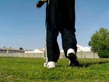

Ok, first I'm going to tell you not to just blindly imitate the motions you see other people do in their setup. Eventually that might work to an extent, but actually understanding this confusing looking yet simple dipping motion will help you with this trick and all the variations. So in this tutorial, I'm going to go in depth into the setup and takeoff, so I won't have to waste time talking about it a lot in tutorials for other Butterfly tricks. Study closely!

## Butterfly Setup: Turn and Stretch

* Pivot Around About 3/4 of a Rotation
* Stretch Jumping Leg Outwards and Forward
* Hold Arms Back for Momentum
* Push In Forward Direction with Back Leg
* End Up Almost in a Wide Side-On Stance

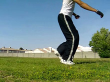 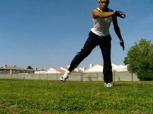 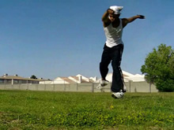

This is the setup that is first of all going to make or break your basic B-Kick and B-Twist, and second of all really going to help you in your advanced Butterfly variations once you get it down right.
### Think About the Ends, Not the Means

Pretty much every time I've seen someone brand new to the Butterfly Kick try to setup it looks like a whack wanna-be mimic of an actual Butterfly Setup. Not to knock them of course, but what do you expect from someone who's never done it before? Problem is, usually it stays that way, haha.
Why does this happen? Because people keep trying to do <i>what it looks like other people are doing</i> in their setup. What they <b>aren't</b> doing is <i>actually DOING what other people are doing</i> in their setup. Remember, you can't read minds. You can't look at what someone is doing and know exactly what they're telling themselves to do most of the time. That is why when it comes to teaching this technique, we're not going to worry about exact, specific details of every aspect of this setup. Instead, we're just going to think about the goal this setup accomplishes, and where it makes us end up. That way, you can get yourself there however you see fit.
### The Goal

The position you want to get yourself into with this setup is this: A wide, side-on stance. That's all you're getting into, because that's what you need to then execute the trick. So for the start, simply pivot around and lead your jumping leg out in order to start getting into this stance. Get your arms up and ready to go.
So, don't worry about hooking or curving or doing something ridiculous with your leg, and then turning your body all awkwardly. Start off facing forwards, shuffle and pivot around about a 3/4 rotation and stretch your leg out preemptively to get ready to dig into that stance.
>### WATCH YOURSELF
>Most people just learning to do this trick just try to do the spin setup, but they end up just doing something gay like spinning around and maybe separating their legs a little. Watch yourself man! Get a mirror, or better yet record yourself and watch how you setup. You rotate around and, and EXTEND the leg out their. See, you have to know what to do. You don't just randomly spin around, that's not what the setup is about. This setup is to get you some flatspin and momentum for the trick. If you do it from standing, well it's just a very awkward position to get yourself into. Watch the setup. Turn to the back, extend the leg way out there. Alright? Cool.
>### Butterfly Setup Deniers?
>Lots of people I run across say don't bother with the complicated and at times confusing Butterfly Setup. They say just pivot into it from a stand. That does work. And yeno if the only thing you ever want to do is a Butterfly Kick or maybe even Butterfly Twist by itself, then sure. If you want to learn any variations beyond the B-Twist, and be able to do anything extraordinary with Butterfly variations in the future, learn the setup. Or, if you want a powerful B-Twist or B-Kick, learn the setup. If you really don't want to, then don't.
>
>If you can already do this and a B-Twist with the setup, try learning them without the setup, though. Just for variety and controls sake. Also, try learning them from a Hook or other setups. As long as you accomplish the basic principles of the next step (digging) along with those, you can always do it!

>Practice simply getting into this stance comfortably before going further. Do it over and over, observing yourself and making changes where necessary. Getting into the wide, side-on stance with your weight over your back leg is essential!

## Butterfly Setup: Dip

* Dig Into Side-On Stance
* Shift Weight From Back Knee to Front Knee
* Turn Body Towards Direction of Travel
* Tilt Upper Body Out, Keep Arms Neutral

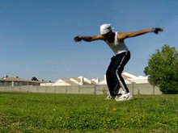 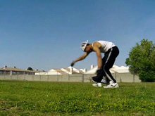 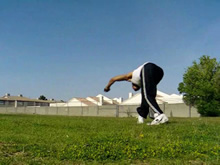

Remember "The Goal", that side-on stance I talked about in the last side? At the very beginning of this step, immediately before you start digging, that is where you're going to be. Your legs a little wider than shoulder width a part, your body oriented sideways relative to the direction you're going, and your arms back ready to go. It's simply, if you've gotten into this basic position, you're good!
### How to Dip

What is the purpose of the dip? To get you horizontal? Barely. Just because? No way. What do you do when you do a regular vertical jump, when you're trying to jump just straight up? You dig down, and then jump up. That's the main purpose of the dip for this trick, to jump back after you've bent your legs down to jump.
So how should you dip? Just bend down a little. Let your legs bend so you can push your legs to extension to jump later. You don't need to lower your upper body that much, unless you want to. I'll talk about this a bit soon.
Even if you're just digging and bending straight down like a regular jump, since your legs are wide you can still move your weight around. Before your start the dip (coming out of the last step), keep your weight over your back leg. As the dip progresses, shift your weight over to the front leg. The weight shift is complimented by actually turning your body towards the direction you're going to be jumping.
### How Not to Dip

Don't throw your upper body down. That's not the point, the point is to dig so you can jump. And dipping your upper body down and throwing it back up isn't going to help you jump. Of course, you may want to lower it depending on your own preferences. But really, just visualize yourself digging down for a vertical jump as you're doing the rest of the setup, yeno? That's all the dip has to be. You're going to need to lean your body out a little bit of course, and if you really want to dip your upper body down a little <i>during the setup, before the takeoff</i>, you can. But the <b>technique</b> of this setup comes from bending in the legs, not the back.
>### Head Down or Up
>Where you put your head as your dip doesn't matter that much, but may effect stuff during the takeoff. If you put it low, and keep it low, your chest is gonna stay down there. This may be what you want, that's how I usually do it. You may want to keep your chest up and level as if you're doing a regular vertical jump, that can work for you too! See what's best for you.

>In drilling this part, you can either start from the beginning and work up to here, OR, you can simply start from the wide side-on stance and practicing the dipping motion.

## Jump and Lift

* Jump Straight Up Off Base Leg
* Swing Entire Back Leg Up
* Pull Arms Up/Out
* Lift Chest Up and Out

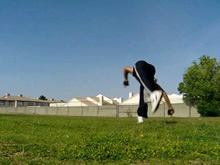 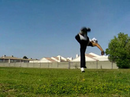 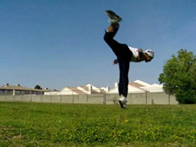

From here, jump up. Before we talked about how you want to dip for a vertical jump, so now, jump like a vertical jump. Jump straight up, as if you're going into the skyyy. Pull your arms up as is comfortable for you.
As you do this, lift your back leg up, and lift it hard. This is very important. The more you lift that leg up, the better. Lift it HARD. It better get up to at least your standing chest level son.
### How to get Horizontal

You don't get horizontal by dipping your head down to your hip level during the dip, that's fools talk. You get horizontal by bringing your hips up to your head. How do we do this? First of all, thanks to the flat spin and our cute little setup, the alignment of our body from foot to head isn't going to be a straight line, it's going to be a little slanted. This means, when we pull our back leg way up high, and when we jump off our jumping leg, our hips will go up to our head level! Or at least relatively high ahah.
Does this mean that we can kick our leg backwards and up with our body upright and do a B-Kick? Not really. We still have to lean and stretch our upper body out a little during the takeoff (read: lean out, not down). This is moreso something you need to tell yourself to do and visualize yourself doing. But anyways, if your body is still directly over your hips, your entire core is going to get pushed straight up. What we want instead, is for your upper body not to be sitting directly on top of your lower body. That way when the force is applied from the jump to the hips, the hips have room to go UP to the upper bodies level.
>### The Upper Body
>What you upper body does here effects how horizontal your B-Kick will appear. Basically, if you want to do the highest looking B-kick you can, pull your upper body up as you jump. Or just don't pull your head down as much when you dip, but yea the dip was the last step ha. In the example slides, I pull my head up and chest up a little, but not too much, thus my hips come up to about my head level, since my back is straight too. In Wushu, you often see people pull their heads way up and even curve their back a little. That's cool! Try that out if you want. Just make sure you still lift up behind you hard, don't be doing any dang vertical B-Kicks. Do not leave your upper body too low, like at your hip level. You don't want it to look like a wanna-be Aerial.

>Practice doing everything in the setup and takeoff, just jump! Don't worry so much about consciously kicking your leg way up, just do the setup and jump from it. Get comfortable with that.

## Kick Up

* Let Swung-Up Leg Drop
* Kick Other Leg Up

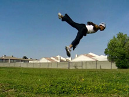 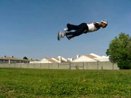 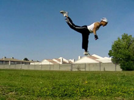

To be honest, this step comes sorta naturally to almost everyone, that is if you can setup and all that correctly. The jumping leg proceeds to kick up behind the body as the other leg drops. To make it better, you want to consciously try to kick the sky behind you with that leg. Weee!
Also, you can try holding up your initial lifting leg longer as you kick the other one up. Mix it up a bit! Of course, you don't want to play with it until you have this down in general. But this step is not so hard, just make sure you have the setup and takeoff down right, and this step will flow easily. This step is not that vital for further variations.

## Land

* Land One Foot at a Time

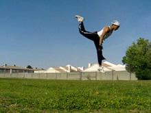 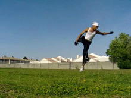 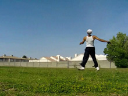

Let your leg drop to the ground, progressing from the last step. Or kick it down. Whatever you like the most. Just land one foot at a time. This is not at all hard to land, so I won't type a bunch of stuff trying to make it look more complicated than it is! Yup, that's the move! Get the takeoff, dip, and jump down well. This will help the move greatly, as well as further your potential for later Butterfly variations!

