# Butterfly Twist
B-Twist

## Butterfly Twist

The Butterfly Twist is the most basic twist out there, and yet this "most basic" is actually a pretty considerable accomplishment. It involves twisting horizontally...and that. It's a Butterfly Kick with a twist instead of a "kick" basically. It's a very common move, even outside of just tricking. It's quite a fun move, with a plethora of great variations; let's learn it!

## Butterfly Setup: Recap

* Execute the Butterfly Setup

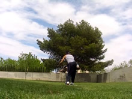 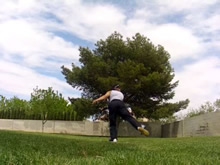 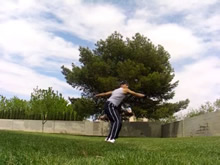 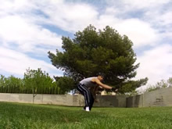

If you can't do the Butterfly Setup well, practice in doing the regular Butterfly Kick before you try the B-Twist. Refer to my Butterfly Kick guide for a more detailed explanation of this setup. Remember, without a strong B-Kick and setup for it, trying to do the B-Twist is futile.
### Emphasis

While this setup is the same that is used in the Butterfly Kick, be sure to put emphasis on shifting your weight over the leg you're going to jump off of, as well as bending down for a jump. Remember, all jumps can be done like a regular vertical jump when it comes to the legs. So let them coil down like a spring, so they can then quickly extend up, pushing you into the sky.
Also, something you want to put emphasis on is not dipping your head down and then leaving it down there. Like I've said a million times, you only need to dip like you would in a regular jump, so your head doesn't need to lean forwards all the way to the ground. However, you're going to want to lean into the setup a little,  so that when you jump, your hips will be able to push up to your heads level.
>### Goal Oriented
>I mention this is my B-Kick tutorial quite thoroughly. Remember, this setup isn't a big complicated deal. <b>The purpose of the setup</b> <i>is to pivot you around to dig into a wide side-on stance</i>. If you can stretch your leg out while pivoting, shift your weight while dipping, and then go up and takeoff, you're good! Don't worry about it look EXACTLY like someone else, just get those basic technical steps down! Remember: your style won't affect your ability to do a trick, your technique will. The peculiarities of someone's execution of the setup doesn't make them able or unable to do it; if they accomplish the aforementioned foundational steps, then THAT is what is letting them do it!

## Takeoff

* Spread Arms To Wrap
* Jump Straight Up, Lean Upper Body Out
* Kick Back Leg Up
* Start Shifting Visionary Focus Around

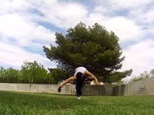 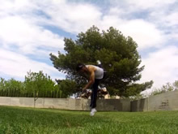 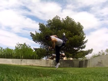

Just as there's a million different stylistic ways to setup, there's a million different ways to take off. Usually each little thing effects the way the trick looks and sometimes, to an extent, what you can do with it.
But before I do, one thing is key no matter what you do: lift that back leg up hard behind you! Lift the thigh up as well as the rest of the leg. In fact, up to this point, just think of doing it like a B-Kick! The only difference between this move and B-Kick is that in this move we're going to do a spin after we get off the ground. So even this step is very similar to a B-Kick.
And no matter what, never forget to JUMP. Regardless, I'm going to explain a couple things that you mostly have to think and feel and see how they effect you.
### Flat Spin: More or Less

The Butterfly Twist turns around your vertical axis (which becomes horizontal during this trick), but you can also rotate around your umm, it's not your horizontal axis haha but you get what I mean. It's like the way you "rotate" when doing a Butterfly Kick. You can do this more or less, depending on how far you shift your upper body over during your takeoff. Some people simply put it in front of them, and do the trick. Some pull it over to the side to get more flatspin and do it.
<b>Effect:</b> It's possible for more flat spin to make it easier to arch your B-Twist (if you want to). Also, it generally makes you face the way you came moreso. It can end up hurting later variations, who knows. Play around, and see. This isn't that important.
### Lower or Higher Upper Body

Some people leave their upper body low, and do the trick. Some raise it up as they jump, and do the trick. Some people never dip it low in the first place, and leave it in the same place during the trick.
<b>Effect</b>: For beginners, it's better to get used to lifting the upper body back up (or not dipping it this much to begin with). Anyways, usually having your upper body lower makes it easier to twist faster, which has it's own effect. Other than that, it's mostly just style and personal appearance preference.
### Face Down or Look Up

During the takeoff, you can look at the ground and keep your head relatively neutral, or you can pull your head back up. Not just pulling your upper body back up, but pulling your head back independently.
<b>Effect</b>: Generally, pulling your head back archs your trick, and makes you lead with your head more. This has an major effect on the look of the trick, but not as much on things like swing throughing or whatever. However, later variations could be effected negatively by this. Experimentation is required.

There's plenty more you can do, I just went over a few. But uhh, ok just jump up and lift up in whatever way is comfortable at first, and worry about that stuff later.

## Twist

* Wrap Arms In, Pull With Shoulders
* Turn Head Sideways to Lead Spin
* Tell Yourself to Spin

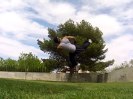 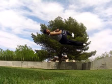 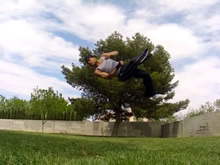

Now comes the twist. One thing not to get confused about, is that this twist isn't some sort of magical horizontal twist. It's just a regular vertical twist, spinning around your vertical axis, but your body happens to be horizontal. So don't try to pull your arms up or whatever, just think of wrapping them around, like you would during a normal vertical spin. Also, look in the direction you're twisting, that helps!
>### Just Can't Twist? Half Twist?
>Ok so, when you twist, do you end up just sort of flopping around onto your back? Do you just never come all the way around? I'm not talking about you just can't land, I mean you just can't really spin in the air at all? You're twisting too early! That is to say, you're twisting while or during your jump. This causes you not to spin at all, it causes you do only do a flatspin around your vertical axis, instead of an actual twist in the air. So, don't twist until you jump. Remember, it goes "Jump > Twist". Not "Jump and twist".

Just like a good kick done in the air, this twist is a result of everything that came before it. If you keep crashing when you try to twist, don't think you can't twist well. The problem is with the previous steps. If you can't do the Setup and Takeoff well, you won't have any material to work with for the twist. If the Setup and Takeoff were done very well, technically speaking, then Twisting is merely wrapping your arms, turning your head, and telling yourself to spin basically.

## Coming Down

* Open Up Arms to Slow Twist
* Lead Landing Leg Down

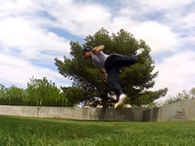

When you come down out of the twist, you can either just uhh, land haha, or you can open up for the landing. Opening up for the landing just involves opening up your body and killing the twist. Open your arms, stop looking over your shoulder, just lala open up.

## Land

* Land, Jumping Leg First
* Optionally (Advanced) Let Leg Swing Leg Through

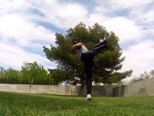 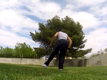 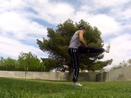

And now just land. The landing is very natural, just like basically every trick I've ever taught haha. Nothing special to say here particularly. When you first learn the trick, you may land with your feet either close together or in quick succession, one after the other. However, once your body gets used to the trick, you'll most likely start naturally landing on one leg. If you do lots of practicing and work on controlling your legs and your landing, you'll be able to swing your second leg through. Awesome! Who knows, if you practice a lot and get your body used to it, it may start happening naturally! But for beginners, simply be happy you got here. :)

