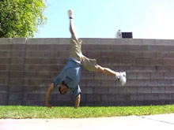

# Cartwheel

## Description

Just about everybody knows what a cartwheel is. You go forwards while spinning around like a wheel sideways, or at least it appears sideways.

The cartwheel is a foundational skill, not only for combinations, but for many further variations of tricks. While not being a totally respectable trick in itself, it is an essential foundation for anyone aspiring to do some sick tricks. Aside from the moves that stem from it, it's a very easy basic move for practicing to have good form.

Do not underestimate the importance of this skill. But, do not overestimate it's difficulty, because it's pretty dang easy. The only time it becomes hard is with bad technique, but that's what this tutorial is for, trying to build good technique :). So study this tutorial and others to help build a powerful cartwheel technique that will benefit your tricks.

## Initial Setup

* Get Arms Ready
* Step With One Foot Forward
* Lean Down Towards the Ground
* Keep Everything Flowing Straight

  

For beginning to learn proper cartwheel form, you should know that the technical cartwheel takes place in a straight line. To that end you want to already establish some sort of invisible (or even visible if you can) straight line that you want to do the move along. Start with your arms up and ready however you feel like it, and point your foot in the direction of the line.

Try to put your leading arm on the line. Don't put both arms down at the same time, keep them spread apart.
### Do Not Be Confused

Look at my arms. Do I swing them back to gain momentum? Do I pull towards one side to go down to the other? No, I do not. You don't need to, in fact these things get you into the bad habit of throwing yourself at the ground. You only need to easy down and forward into the move, you don't need to "charge up".

Also, you don't approach this move by going into the side, note at all. Your feet face forwards and you extend in the direction you're going, even if your chest faces the side.
>### Watch Yourself
>It's important to watch yourself (physically, like with a camera or mirror haha) and make sure you're not making the mistake of trying to dip sideways. And make sure you're not doing the stupid arm charge up thing. I don't care if you think it'll feel better, do NOT do it.

## Lift

* Lift Back Leg Up Straight Behind
* Push Forward
* Weight Shifts Over Hands
* Push Off with Base Leg

 

This is when you takeoff into the cartwheel. What you want to do is push forwards and try to lift your leading leg up (by lifting behind your hips) and around you while traveling in the line you I talked about before. Let's break down the two components.
### The Legs

To re-emphasize, your leading leg (my left in this case/example), gets pulled straight up behind you. Why behind you? Think about the move: when we takeoff, we're going forwards, and our foot (that's still on the ground) is facing forwards, right? And we're going to turn to the side in the middle of the move, correct? So, in which way should we lift our leading leg to get it as high as possible? Behind us of course, because as you can observe, when we lift behind while going forwards, the leg goes up in the air, and when our hips turn over, the leg is still way up in the air, but over us now. Thank goodness our hips can turn over while keeping our legs in the same place.

As your leg begins to stretch upwards to a reasonable extent, push off with your base leg. This is going to be a mere flick of the calf in reality.
### The Arms

Remember the line I talked about before? And how we put our first hand down on that line? Well, now we want to put our following arm down on that line (or, on the opposite side of the line if you want). And what's more, you really want to reach with it to help gain more momentum in that direction. That will help you wheel around.
>### Why It Looks Sideways
>You see it now? This is why (standard) cartwheels always appear sideways, especially to the untrained eye. And this is why many people try to do them sideways. See what happened? Even though we took off going forwards and pushing forwards, since we put both our arms on the line that was perpendicular to the direction we were going, we've turned our chest, hips, and subsequently whole body to the side. Good deal! This is one reason why we can simply lift our leg straight.

### What It's Basically Like

Have you tried going up into a handstand? Not necessarily holding it, but just kicking up into it. Yeno, when you kick your leg back up until it's over your head? If you do that while pivoting on your hands, then let that leading foot drop. that IS a cartwheel. It is not complicated at all. It's not some awkward sideways stretching technique. It's very simple: so simplify it in your mind. You're just lifting your leg up backwards, and then putting it down on the other side. So the relevance to this step: Simply pull your leg up backwards behind you. Don't try to pull it sideways or anything, just pull it back up.

In fact, to drill you can practice just kicking up into a handstand, haha. With that, practice pushing with your base leg (the one that comes up last). It's almost as if you're trying to jump with that leg, it helps drive the cartwheel.

>Practice just lifting up, and come out of it naturally. If it helps, just practice kicking up into a pseudo-handstand, then letting that first leg come back down. If you can do that, completing the trick is just doing the same thing, but pivoting on your hands.

## Stretch and Turn

* Keep Legs Spread
* Keep Moving Forward
* Start Bringing Leading Leg Down

 

Now how do we exit the cartwheel? Surely we don't want to try to land sideways, with our foot facing sideways. If you try that, you're either going to strain yourself, sprain your ankle, or most likely: fall. Either way, you fail.
So, first we need to turn over. One thing that will help is looking in the direction we're going, which would be that line I keep mentioning.
For aesthetics, try to gain a nice stretch between your legs, by leading your leading leg, well, even more? Hehehe.
Let your trailing leg flow in the path your leading leg is following.
This step flows right into the next one.
### Leg Direction

We don't lift our legs sideways at any point in the move because the "sidewaysness" or the move simply comes from the fact that our body is pivoting from our hands and shoulders. I'm reiterating this again, for this reason: Remember how in the last step I said you simply need to kick your leg up straight back behind you while lifting? Well, once it's overhead in the air, simply pull it back down straight. It's like exiting a handstand, just kick the leg down straight. So, in it's entirety, this move is like entering a straddled handstand facing one direction, and exiting it facing another.
>### Want to Turn Over More?
>For certain combos or for variations that land on both legs (Roundoff) or the opposite leg (Switch), you're going to want to turn even moreso so you face the way you came. In this case, you want to try to put your second arm farther over, farther past that line. This will turn your chest over more, yay.
Alternatively, you can try to focus your head harder in the direction you're going to turn over more, or lift push the first arm you put on the ground up sooner, and carry it our to turn you over.

## Pull to Landing

* Bring Leading Leg Down to Completion
* Push Off Ground With Hands Optionally
* Stand Up

  

Try to even moreso spot where you're going to land at this point, that is to say, where you want to pull your foot down to.
Bring your foot down straight and forwards. This means, you want to sort of kick at the ground with the front of your foot. After all, we took off by pulling our leg straight back, so we can surely pull it straight forwards. And pulling your leg straight down is a very easy motion for your hips and body to perform, so this means we can land nice, clean, and high.
As your leg starts to come down, lift your first arm up off the ground, and then the next one when it feels comfortable. You can try pushing with your arms a little if you want, but you don't really need to.
Anyways, there you are, a nice simple cartwheel! Go try it, or better yet, go try to do it right! :)

