# Cheat 720
Cheat 720 Kick/Crescent/Hook

## Description

The Cheat 720 is a basic yet, by no means too easy spinning and kicking skill. It involves doing the cheat setup, and jumping while turning over towards and past your target, then spinning around in the air again and throwing a hook, wheel, crescent, or outside-hybrid kick. Between spotting the target and spinning around, there is usually a pump. This is a motion used to help control the kick and the whole move in general.

## Opening Notes

I want to start this tutorial by saying that I'm going to teach you what some will say is the best acceptable style of Cheat 720. What is this? Well it doesn't mean that it's the wonderful best C720 ever. In fact, in the demonstrate slides/video I specifically performed the move extra slow and controlled, just for the sake of doing it slow and controlled.
Anyways, many people make huge mistakes on this trick that makes it ugly. They try just to do a "Cheat 720", without actually trying to do it correctly.
Often times, these mistakes include not pumping, kicking low, kicking off target, not spinning adequately, or just looking plain ugly.
Seriously, don't settle for that crap. In a good Cheat 720, you will be looking at the target in front of you when your kick passes through it, the kick will pass all the way through the target and across, and the kick will go as high as you can perform a standard outside kick.
Remember, I'm going to be teaching you what people DO to do good Cheat 720s. Don't think about doing what it <i>looks like</i> they're doing, instead do what they ARE doing. So what ARE they doing? Let's find out.

## Cheat Setup

* Perform the Cheat Setup

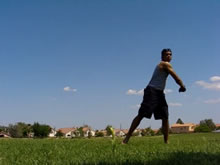 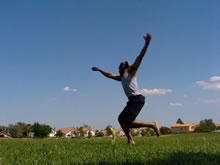 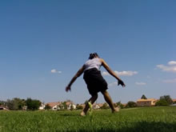

This is the standard cheat setup. Turn around about 3/4 a rotation from one foot onto the other. Notice in the second slide I bend down on both of my legs, while keeping my body upright. This is important. Why?
As I'll go on to talk about later, you want to pull your arms up yes, but you don't want to "rip" them up or reach up, you want to rip and reach <i>around</i>. To that end, the most of our height has to come from the jumping power of the legs. So make sure your legs bend so you can use your powerful leg muscles to jump up.
The arms should be basically like you would when setting up any cheat trick, go from up to down whilst going around in a nice circle.
### Controlling the Setup

Especially when learning this trick, you want to focus on controlling your setup. If you rush things too much, you may end up compromising your jump or flatspin, or you could end up jumping out at an angle. Don't be afraid to slow down the setup a bit so you can have full of control of this technique, because this trick is very technique heavy.
>### Over-Cheating
>I never really had a problem with this, but some people over-cheat their cheat setup. How do we fix this? Think about what I just said about control. You want to have total control of your body in the setup, so don't be afraid to slow down this part of the trick. Watch your foot, if you want, try planting it early. Or, force yourself to stop anticipating the spin. Break down the steps in your head, the setup is one step, the takeoff is another. Don't mix them together, for this can lead to over-cheating.

## Takeoff and Flat Spin

* Jump Straight Up
* Swing Arms Around, Turn Body Around
* Lift Leading Leg Up and Around with Body
* Spot Target Initially

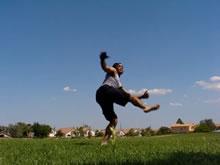 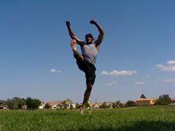 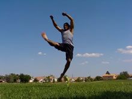

Now here comes the important part of the trick: the takeoff. The takeoff makes or breaks many tricks. Turn over towards your target and pull, while pushing straight off the ground with your planted leg. Imagine pushing in a straight vertical line with that leg, so you go up, and don't travel too much.
### The Essential Flat Spin

Flat spin is essential for basic any vertically spinning kick tricks. Why? Well if you just jump off of the ground straight up, you're not going to have any rotating momentum, or it's going to be negligible. This means, when it comes time to spin around and kick, you're going to have generate enough force, in mid-air, to completely rotate your body around a full rotation, and kick. Screw that! The flat spin gives us some spin coming off the ground, and is later complimented by the standard spin.
If we don't have enough flat spin, the trick will either become impossible, or very difficult. So what should we make sure we do? <i>Pull</i> your arms and body around. You want to spot your target yes, but you want to PULL past your target. You can keep spotting your target as you pull the rest of your body past it, get that flat spin really going.
### Do NOT Try to Spin in the Air Now

You heard me! The flat spin and the mid-air spin are two COMPLETELY different motions. They compliment each other, but they are by no means the same. If you try to do the mid-air spin coming off the ground, you're going to screw yourself over, and do some crappy flat spin kick. Often times, people do this and then throw out an off target kick. Don't spin until you're in the air! Actually, I'll tell you when to spin later...
### Don't Lose Commitment

One of my problems was after doing good Cheat 720's I would get crappy at them because I would cut my flat spin short. And one primary way to do this is to rip your arms up instead of around. Really make sure you're pulling past your target whenever you takeoff. One thing that helps me is keeping my arms open but in a curled manner, like in the picture, so I can later wrap them in, instead of throwing them way up above me.

>Practice just hitting the setup and taking off: getting into the air upright with a lot of flat spin. Get used to this step, don't add the wrap yet.

## Pump and Spin

* Wrap Arms, Pull With Shoulders, Spin
* Start Re-Spotting Target
* Pump Jumping Leg By Bending it Back In

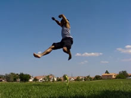 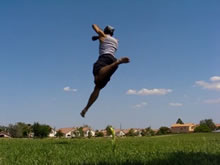 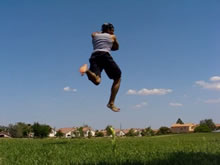

One thing you'll notice that, at the start of these frames, I was beginning to bend my non-kicking leg behind me in the last set of images. Good! Do that. This is the pump, and trust me, it helps. I used to do it without the pump, then I tried the pump, and now I'm never going back!
How do we pump? Basically, bend your non-kicking leg. Kick your butt with your foot. Some say to bring your knee to your target? Does that work for you? Try it. Some say to straighten the kicking leg and press it down. Does that work for you? Try it. I personally don't have to do either of those things, at least consciously. My kicking leg pulls down out of habit, yay.
I'm putting these both as the same step, but make sure that you tell yourself pump, and then afterwards spin. You can pump then spin the very next instant, or you can pump then stall the spin a couple moments, whatever works for you. When you spin, wrap your arms over and pull them around. And do this HARD. Even when you get used to these, never loose commitment in wrapping your arms. Pull them hard over, and try to look around and re-spot your target.
>### How Does the Pump Work
Basically, when you bend your leg back, you're totally getting it out of the way of your other leg, as well as creating a bit of force to help get your hips to spin around. It also, for some people, keeps you from rushing the spin too early, because you must perform the pump before you spin.

### Spin

Along with that pump, spin! That's the important thing. In Fact, when drilling just these steps, practices just adding the spin here, and worry about pumping after you can do that well. Wrap your arms, turn your head, try to re-spot that target, tell your whole body to spin! This is the actual spin, the twist, the wrap, and it compliments the flat spin you got when you did the take off for this trick. SPIN!
>### Importance of Rhythm
>This is a very intricate trick. Not that it's hard, but there are a lot of steps that have to be done separately and distinctly, but also quickly and flowing. That's why I'm going say to drill particular sets of steps a lot in this trick, because you need to be able to put each and every step of this trick together to get it done. You can't mix steps, you can't compromise a step, they all must be done. And that's especially true once you get further into the move. So really, practicing drill from the ground off. First practice the Setup. Then Setup > Takeoff. Then Setup > Takeoff > Spin. Then Setup > Takeoff > Spin & Pump. Then Setup > Takeoff > Spin & Pump > Chamber (next step). Don't smash all the steps up, instead, quickly just do them each. 1-2-3...1-2-3...

>If you want you can practice doing the setup > takeoff > wrap / pump by itself. Don't worry about throwing the kick out yet: the anticipation of doing so can throw off your technique. Get used to the feel of everything up to here.

## Spin to Kick

* Keep Spinning
* Start Re-Spotting Target
* Turn Body to Be Able to Kick Target
* Chamber and Prepare Kick

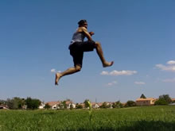 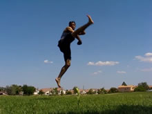 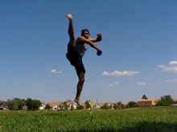

You can begin to chamber or prepare or even begin your kick as you turn over to spot your target. Generally, you want to consciously tell yourself to wait just a split second to kick. Keep pulling your arms over towards the target, as well as spotting the target with your eyesight.
### Don't Kick Too Early

If you try to kick too early, like immediately as you start spinning, your kick will come out low, askew, off-target, or any mix of those. Remember, you want to spin and then kick, not spin AND kick at the same time. Obviously you'll still be spinning as you kick, but you want to initiate the spin (in the previous step), and then kick afterwards.
### Wrap Over Here

You want to really pull your wrap over to here. The more aggressive the wrap, the easier you'll be set up to through out the kick. Make sure your arms, especially your back arm, don't lag behind you. This will keep your chest back, which will pull your hips back, which will cause your kick to come out off-target and low. Commit to that spin! Don't open up or kick until your body is oriented in a way to be able to throw that kick out at the target! Timing! Rhythm!

## Land

* Land, Non-Kicking Leg First

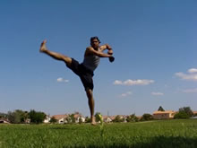 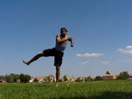 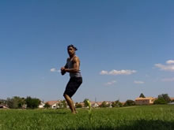

Now land. Land on your non-kicking leg, and either pull the non-kicking leg down yourself or let it flow out of your kick. You'll know you had good technique if the leg has passed up through its target and is now coming down to the side of you. Try to control the landing as much as possible if you want. One thing you can do to exercise control of the landing is to, when your leg comes back down and around, is to then force it to the ground and set it there (I don't do this in the example). Or you can be like me and just flow around out of the trick cause it's fun.
>### Landing Off Balance
>Just an side-note, you can land relatively "off balance" with Cheat 720's and still recover quite easy. Why? With just about any outside kick, your leg will sweep around behind you, this allows you to pivot as much as you need to guide your leg to a position in which you can regain your balance. Neat huh? Unfortunately, this doesn't quite work with inside kicking tricks, since to regain your balance you usually stumble over or something to that effect.

Anyways, enjoy! Go learn a good Cheat 720!

