# Cheat 720 Twist
540 Twist

## Description

The somewhat controversially named Cheat 720 Twist is a slightly advanced twisting trick involving circa 540 degrees of rotation in the air. But that doesn't matter! It's a horizontal twist, like the B-Twist, but done from the Cheat Takeoff.

Some say it's a Raiz Twist. Not really. Actual Raizes are inverted, and flip over. They're not truly a side to side turning move. A Cheat 720 Twist is done straight up side to side. In all honesty, it's basically a horizontal Cheat 900 with no kick. Think about it!

In Capoeira, most practitioners <i>do</i> do their Cheat 720 Twists as a Raiz twist. It's awesome! But in tricking, that version is hardly used, and it's not the type I'm going to be teaching. Alright? Alright! Many people have lots of trouble with this trick, I used to as well. And it's usually the same problem, and I'll address it here. But to be honest, this trick isn't as hard as many might think. Let us begin!

## Cheat Setup

* Perform the Cheat Setup
* Lean Out Just Slightly More Than Usual

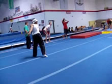 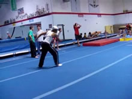 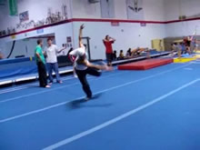

Do a Cheat setup similar to how you do a Cheat setup for basically anything, such as a 540.

Any differences? You want to dip down a little to help you get horizontal. Of course, if during the takeoff you can kick your leg up really high while tilting out a little to get horizontal, you don't need to dip down as much. You do need to make sure you dig though, and open up those arms!

## Takeoff

* Perform a Cheat Takeoff - Laid Back
* Swing Arms Up
* Turn to Spot Ground With Head
* Lift Leading Leg Up

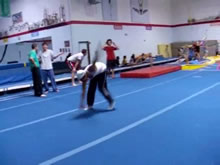 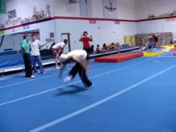 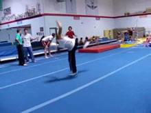

>To help yourself visualize setting the jump up high...
>
><i>Visualize yourself jump and turning high over an obstacle, so your back passes over it...</i>
>
>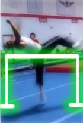
>
>Preferably, one glowing <i>green</i>.

Here we go! Arms open wide, and swing up into takeoff. Pull your leg/knee up towards the sky. Really try to kick it up to help get you horizontal, although, that won't be enough by itself. You also need to tilt your upper body out away from your body, like mine is in the demonstration slides.
Also, just tell yourself to be horizontal, haha. Simply doing that can help you achieve the horizontal position. You want to tell yourself to pump your hips up towards the sky when you jump too. So basically that, kicking your first leg up, and tilting out a little combine to get you horizontal.

Make sure you jump. Really jump UPWARDS, throw everything upwards. Think of elevating your body up into the sky.

>### No Compromise!
>Remember, just because you're getting horizontal doesn't mean you have to sacrifice height. So don't! Think of it as if you're trying to jump sideways over something. See the little illustration on the right. It's hard to tell you exactly what to do with your body to get horizontal, because lots of the motions to get you horizontal come by telling your body you want to achieve a certain goal. So as I said, view the illustration on the right for an example of how to tell yourself to go up, while still going horizontal.

### Turning

One important thing to remember is that in the Cheat 720 Twist, or any twist done in the air at all basically, you never begin the wrap/twist/spin until you're off the ground.

That being said, we need lots and lots of flat spin for this move. So as you're jumping up, reaching up, POWERING your way up, turn hard hard hard! Just turn your whole body over in the direction of the twist, and look over in the direction of the twist. Just turn! It gives you flat spin baby!
But, keep your arms in! Remember, as you takeoff into the set, you're going to be turning, not spinning. If you start trying to spin or wrap during the takeoff, you're going to spin a little, while falling. But, just because you're not wrapping yet, doesn't mean you can't turn hard! As you jump and do the aforementioned things, really rip around as you go up, but keep your arms open and shoulders prepped, so that you can twist/wrap/spin later on...

## Setting

* Complete the Jumping Motion
* Keep Turning Body for Flat Spin
* Let Body Leave Ground
* Don't Wrap Yet

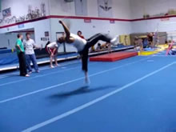

This is the definately the biggest problem faced as people try to learn the Cheat 720 Twist. They don't set! They setup and all that, and then they turn around quickly as they takeoff, and try to twist then. No no no! Haha.

Look at my body position in the air. The jumping leg is fully extended, the leading leg is stretched up into the air (from the last step), and body is turning (yes, actively turning around), and everything is going <b>up</b> into the air. Look, I'm heading way up into the sky! You want to try to set yourself up high! It's like the illustration I used in the above step, you want to think of it like you're trying to jump and turn over an obstacle that's higher up, like around your chest level.
Set yourself up! Jump into the trick! You need to go up! Do all of this!
In reality, it's just like the very simple B-Twist. In a B-Twist, you jump, start the B-Kick (set), and then twist right when off the ground. This move is just that easy when you simply do the set. I'll talk about this a little more in a box in the next step.

>This step "Setting" is really a part of the takeoff, it's just being emphasized. So, practice doing the trick just Setup > Takeoff. It should be like a horizontal step over, or pseudo-Raiz, whatever. Once you get comfortable with setting up into that, completing the trick is as easy as adding the next step (Twist).

## Twist

* Twist - Wrap Arms In
* Start Re-Spotting Ground (Turn Head)

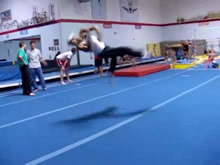 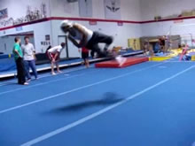 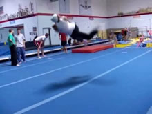

Notice how in the last step I had just left the ground! Ding ding ding! That means it's time to twist! How do we do that? Just twist!

We already have lots of flat spin from turning into the takeoff, and now after we've set the trick into the air, we can twist! We can twist our little hearts out! Pretty awesome, I must say. It's quite self explanatory, and not hard. Just wrap your arms in tight, pull your arms/shoulders around for the twist, turn your head and look over your shoulder for the twist, and just tell yourself to do it! Yea!

>### Drawing Similarities
>Ok, I already said that a Cheat 720 Twist, in tricking, is never really done as a Raiz Twist. So first I need to definite what kind of twist it is if it's not a Raiz Twist. It's more like a, horizontal-laid-back-tornado-kick-with-no-kick twist, or a, crappy-uninverted-side-to-side-raiz twist. Let's just call it a horizontal step over. Just imagine what the Cheat 720 Twist would look like, if you did the takeoff and set, but didn't twist. That's what I'm talking about.
>
>So now, on to the point I'm making, yeno a Butterfly Twist right? How it's basically the Butterfly Kick takeoff and set, with a twist? Well, the Cheat 720 Twist is the exactly same thing, only instead of a Butterfly Kick, we have a horizontal step over! Neat, huh? So B-Kick is to B-Twist, as horizontal-step-over is to Cheat 720 Twist. Does that simplify it in your mind a little? I hope so.
I mean, look at the middle frame of this step. That looks sorta like the position someone is in when they're about to set into a Butterfly Twist, only it's in the air. So what, if you can get into the position, it's like you're just doing an extended Butterfly Twist. Yay! Ponder over ways to simplify this trick, because I think it's very over-thought.

## Land

* Land - One Leg at a Time

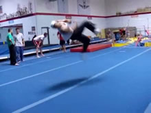 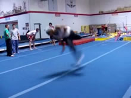 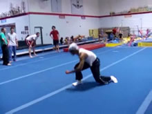

Keep pulling all the way into the landing. Really pull that twist you started all the way through. Rip rip rip!

And after you do, the landing is extremely natural. You may land with your hands down, but if you land on both of your feet, you're good! That means you did the technique right, more specifically, it means you got enough flat spin during the takeoff, set properly, and twisted once you were set!
If one of your legs misses the ground, or your knee fall onto your knees, or on the side of one knee, possibly with one leg flailing out a bit, you didn't set enough! Really jump that set (one of the previous steps) UP into the air, then spin spin spin!
And that's it. Not a very elaborate tutorial, huh? That's because this move just isn't too complicated! Woo hoo!

