# Cheat 900

## Description

A Cheat 900 is a natural progression of cheat spinning kick moves. You do your Cheat Setup, takeoff, spin around, and throw a kick with your inside kicking leg. To this end, you spin more than you do in a Cheat 720, and spot your target clearly before you kick. There's not much to say! When done well, this is quite a good looking trick. This trick is in the Intermediate category for some reason, but it's actually not that hard. You just have to approach this trick a certain way, and that's how I'm going to teach it in my tutorial. Watch!

## Precursor

I'm going to say this now: approach this move as it's own move. Why? Because it seems many people try to do this as a Cheat 720 but spin around more and throw a kick. Well, this can help, but a Cheat 720 allows us to be much more lenient with all the things we do in the trick. We can lean back a little, we can slow down a little, we can do this and that. But a Cheat 900 requires strict (yet simple) execution to be able to throw that kick out there. Of course, you should still know a Cheat 720 before this trick, to have the basics of the flat spinning cheat takeoff and it's counterpart "the spin" down.

And I'm really stressing to get that kick high. Really, there's no reason that kick shouldn't be able to cross around at least your chest/shoulder height in a full kicking arch. This is where good, focused technique comes into play. So...
### Effective Means of Learning

In most of my tutorials I break moves into a series of steps, which they all are. I am going to do the same for Cheat 900. However, I'm going to tell you to practice each series of steps (drills) once at a time! This means first start out practice Drill 1 a few times, then when you're ready add Drill 2 to that, then after you get used to that, Drill 3, etc etc. Just having drill points for this tutorial isn't enough, I'm going to base the entire instruction of this trick around the concept of breaking it down into parts and drilling each one successively.

The Cheat 900 is a series of many steps, so some people get confused and rush these steps or mix them together, causing the trick to be hard. But it's not! So practice only doing a certain number of steps when you're learning this, and progressively build onto that. Thanks to the nature of the Cheat 900, we can only do a limited number of Steps and still land on our feet and get a feel for them. So let us begin.

## Cheat Setup

* Perform the Cheat Setup

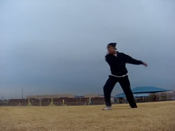 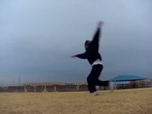 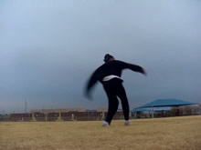

You already better know how to do a Cheat Setup very well if you're trying this. So I'm not going to explain this any more. Remember, I go into it in detail in some of my other tutorials.
Although I will say this, try to focus more on swinging your arms around from side to side, rather than up and down...

## Drill 1 - Takeoff

* Perform the Cheat Takeoff
* Focus On Staying Upright
* Emphasize the Flat Spin
* Spot Target Initially

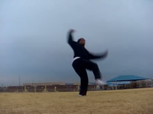 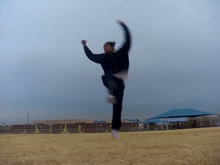 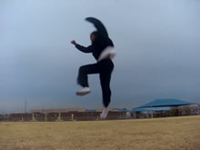

Ok, this is the first drill sequence I want you to practice. <b>Cheat Setup > Takeoff</b>.
This takeoff is similar to that of a Cheat 720, or any other cheat trick. Lift your first leg up (not too much) as you turn towards the front. To spot your target. In Cheat 720's some people spot there target for quite some time. You don't need that much in Cheat 900's, you can glance at it, just establish where it is, then pull past it. You can keep looking if you really want.
### Emphasis on Upright Flatspin

This is extremely important. You <i>need</i> hecka flatspin to be able to do this move efficiently. If you have lots of flatspin, this trick becomes very easy for your body to do. Don't throw your arms up, try throwing them around laterally, a side to side swing. (My example slides are a terrible example of this.)

And don't just jump up and face your target, keep pulling past it. Don't try to spin around yet, but as you jump pull far past your target with your whole body.

I'm also going to emphasize not to try to throw the arms up. Throw them around. You don't want to direct your energy up with your arms, you want those to stay relatively low (again, my current slides are a terrible example of this), and focus their energy around in a circle.

You go up because you jump off one foot. And you want to try to visualize your jump going straight up, and really push off that ground so you travel straight up, even though you're turning towards the side. Don't jump off towards the side too much, try to go up.

And also, this trick is upright. Don't lean back, visualize yourself standing straight up vertically. The following tip will help with this...
### Relax, and Don't Even Think About Spinning!

Don't try to force this. This is one thing people do wrong when they try to spin too early, they rush this setup. <b>Relax</b> Remember, you're only doing up to this drill right now. Just do a nice calm jump and takeoff, you can do this in your freaking living room.

Also, do not even think about spinning around now. This is a very newbie error, trying to spin around using the flatspin, or spin off the ground. NO! Do not do this by any means! The flatspin from the takeoff is it's own motion, the spin in the air is completely different! So for now...
### Stop here...

Remember, this is the first drill! You want to practice only <i>up to</i> this step at first. Just get a feel for this step. Just set up, then jump into this flat spin. If you do this well, you should jump and land on the same foot you jump off, having rotated over towards your side or behind you in that little amount of time, due to your flat spin.

If you jump and only spin a minimal amount (less than 90 degrees), you fall, you land off axis, you need to rework this step. Practice it. Most important, don't force this drill, stay upright, and pull across for a nice flat spin.

<b>If you're comfortable with this small drill move, add the next motion to this...</b>

>Work on just going up to the Takeoff. When you do this, you want to be upright, have your arms open enough to wrap, spot your target, and have your leading leg lifted up. The key factors here are having the flat spin from the takeoff, and being upright.

## Drill 2 - Add Spin

* Wrap Arms and Spin Body
* Start Re-Spotting Target
* Focus on Staying Upright

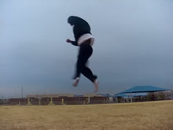 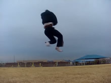

<b>Cheat Setup > Takeoff > Spin!</b> That's right, now it's time to spin around! <b>The flat spin while you're jumping and the spin in the air are two <i>totally</i> different motions!</b> These motions compliment each other, and you need them both to execute this trick well, but remember they are two different motions. Don't try to do them at the same time, don't try to slur them together.
### Emphasize the Wrap

Wrap hard, alright? Since this trick spins vertically more than like a Cheat 720 or whatever, the wrap is essential. So right after you've jumped and you're leaving the ground, spin and WRAP. Pull your shoulders around, wrap your arms in, look over and think of trying to spin around spotting your target again. Just spin!

The momentum from you spinning/twisting in the air gets added on to your flatspin. This is why it's essential to have a nice flatspin, because if you don't, then you have to try to spin around from almost a "stand still" in the air, which is very difficult, and kills the Cheat 900.
This is also why you don't want to throw your arms up when you takeoff: because it's very hard, awkward, and uncomfortable to try to spin around laterally if you've thrown your arms up. This is why, in the last step, you want to keep them concentrated and near your center, and throw them <i>around</i> not UP.
### Before you Move On...

Now, if you've done this step well, you should land facing your target. And most importantly, you should be able to do this with relative ease. Remember, this is a nice calm easy going move if we just do the drills we have so far. If you're not rotating enough, or if it's extremely hard, examine yourself. Are you wrapping enough? Are your arms flowing around in a circle from the takeoff until you wrap in? Maybe you need to go back to the last step and rework that. But it's really not that hard.

<b>Once you're comfortable with the motions of this trick up to here, move on to the next step...</b>

>To recap: Onto the last step, now add the spin. Wrap, and twist around to spot the target again. Focus on completing the rotation and especially on remaining upright.

## Drill 3 - Switch and Chamber

* Switch Legs In Air - Non-Kicking Leg Drops
* Bring Kicking Knee Up
* Hold Spin and Wrap
* Re-Spot Target

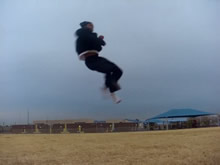

<b>Cheat Setup > Takeoff > Spin > Switch</b>. Very quick, very easy step to add. Don't do this when you tell yourself to spin (from the last step), but immediately after you tell yourself to spin, just switch your legs. I'd say switch them when you're facing behind you, the opposite direction of your target. This is nice and easy, make sure you have the last series of steps down well before you do this, so you can easily just switch your legs without giving it too much though.

Just push your non-kicking leg down straight (it should already be at least a little bent), and lift your other leg up a little, bent of course. This bend provides the chamber for the kick. You might want to lift your leg towards the target as you bend it for a chamber, but I wouldn't worry about that for this drill.

Just do all the other steps, but switch your legs. Do not switch too early though. You should be facing your target, and your leg should be ready to kick. In fact, if you're doing this <i>really</i> well, you might have a little pseudo-kick flying out on it's own. Either way, you just have one more thing to do. <b>When you're comfortable with all these motions, add on the last one.</b>

>Simply add this step to the end of your last drill. Make sure that you are performing each phase of the trick sequentially, step by step, with no step being compromised.

## Final - Kick

* Open Arms (Naturally)
* Fully Extend Kick Through Target

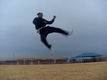 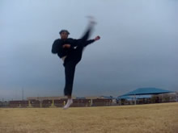 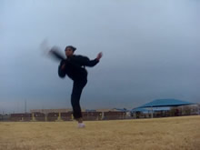

<b>Cheat Setup > Takeoff > Spin > Switch > Kick</b>. And now we're here, just do all the steps from before, but add a kick onto the end! Hiya! It's important to have all the previous drills down well, so throwing the kick out doesn't confuse you. Make sure not to kick too early, especially when you're first learning. Kick after you switch, and you should be able to see your target when you start it. Kick it hard and up! Hiya! I throw a Crescent Kick in my example, you can throw a Round or Roundhouse if you want, or even a Front. Just kick up, and kick hard! If you've done all the steps before this well, this kick should be able to fly out well, you shouldn't have to force it. If you find yourself forcing the kick, go back to the previous drills, and do each step sequentially until you find which one you need to work on.
KICK!

## Finish and Land

* Land - Non-Kicking Leg First

 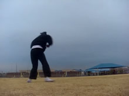

And now, we're here. This is not hard. Your kick comes across and starts to finish as you land. Just let it come down, it's all naturally from here. You might have a lot of momentum from this, I tend to, so you can do a small little rebound turn around to smoothly let this momentum flow, you need to watch the video to see this. But it's just a natural landing, so land. This move is not that hard, but you need to give attention to detail. Go learn it, and learn it </i>well</i>!

