# Flash Kick
Back Flip Kick

## Description

The flash kick involves performing a stretched backwards flip while throwing an axe-like kick during and to the finish of the trick.

The move can be done with only extension of the kicking leg with the other leg tucked in however much. Alternatively it can be done with both full extension of the kicking leg and with the non-kicking leg straight. This requires greater flexibility. In any case, there should just be a kick reaching full extension above the head and to the ground.

This can be preceded by a roundoff for greater height. Doing it this way also allows for greater extension of the of the non-kicking leg (as we discussed before), since there is more air time to concentrate on the split of the legs.

## Dip

* Bend Down Like a Normal Back Flip

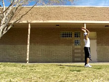 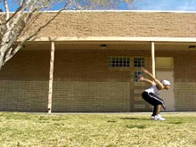

This dip is identical to that of a Back Flip. Bend down, not too much in the legs. Don't let your legs bend too far, for if you bend them too far, you lose jump power. About how much I do in the example picture is about what is good. Yup, that's all there is to say. If you can Back Flip, you can do this.

## Jump and Stretch

* Jump Straight Up With Legs
* Arch Back And Swing Arms
* Start Spotting a Target Behind You

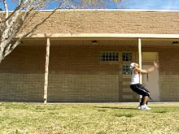 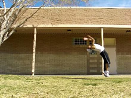 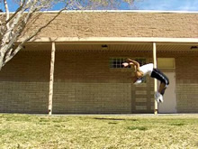

>Even though we're trying to jump as straight up as possible...
>
><b>As well as trying not to pull ourselves backwards...</b>
>
>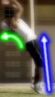
>
><i>We can still arch the trick by looking backwards!</i>

Now comes time to jump. Similar to the Back Flip, you want to jump <i>straight</i> upwards. Direct your energy straight up, in a straight, vertical line. Don't try leaning back.
<i>However</i>, you do need to arch backwards! The arch stretches out the move, and generally makes it quite easy to push out the kick. And it just makes it look good. So yes, while you're jumping straight upwards, you still need to arch backwards.
### Creating the Arch

Ok I'm stressing a lot not to lean back, so how do we arch without leaning? Simply enough, tilt your head back! That's how you arch in any move. Push the back of your head against the back your neck. Tada! Arched back. Something that was especially helpful to me when getting this move clean was to pick a spot behind you, and look at it, as you jump straight up. Don't lean your whole body back towards it, just look at it with your visionary focus, and subsequently head, as the rest of your body extends upwards.
>### Difference Between Arching Back and Leaning Back
>Ok just since I'm always preaching to arch but not to lean or whatever I should clarify the difference. Arching your back means just that: your back archs, and your head is tilted back. Leaning back on the other hand, is actually pull backwards, like pulling your back down and backwards. Leaning back makes arching back somewhat easy, but it depends.
>
>You see I always say not to lean back (too much, you'll have to a little usually) when jumping into a move because what does this do? It means you're not directing your energy upwards! You're pulling your anatomy downwards and back. You can still arch backwards though, while still directing your energy upwards. Of course, you won't jump as high into the air as when you're head is neutral, but arching helps some moves look and feel right, and is required for quite a few. Plus, you can arch on moves that aren't even flips, this creates it's own look, and may or may not hurt that move.
Leaning back while taking is generally only useful on moves where you want your head close to the ground or if you want to put your hands on the ground, like Back Handspring.
>
>But, what if you've already jumped and you're up in the air already? Can you lean back then? Sure, it depends though. In some moves, this helps you flip faster, since you're sorta whipping yourself back. Think about it, since you've already jumped, and directed your energy upwards, now leaning back will flip you in the air, instead of making you jump backwards, sweet! It doesn't have an application in many moves though.

If you want, you can chamber for the impending kick here. Usually jumping upwards and firmly bends your legs under you a little, but if you want you can consciously bend your kicking leg in for a heavier chamber.

## Kick

* Kick Leg Firmly and Quickly To Ground

 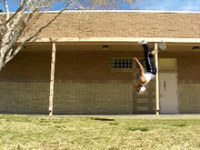 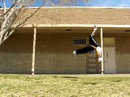

Not much to say here, kick! Remember how I recommended picking a spot behind you to look at? Well now, kick at and through that spot. Just think of kicking your leg to full extension and kicking it down at your face. Just kick, dang it. It shouldn't be that hard haha.
And as you get better, practice doing it harder and harder! RAR!
If you want to, you can consciously pull your non-kicking leg back or straight to make your trick look better.
If you try kicking too early, not only will you most likely fall a little, but the kick will not come out well at all.

## Land

* Pull Kick Into Landing
* Let Other Leg Land Naturally

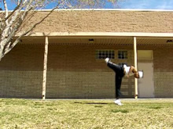 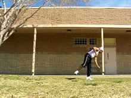 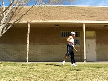

Continue the motion of the kick down to land on that leg. Simple enough, I don't have to instruct you to do that, it's a natural thing that happens when you do the above steps.
If you want, bend your leg as you land a little to absorb more impact. I don't think I do that as much in my example...silly me! But yea, that can help.
And that's the trick! Not too hard, only four simple steps in this one. Just keep in mind the straight up jump, arch, and kick! HIYA!

