# Front Flip
Front Tuck

## Description

The Front Flip is the brother of the Back Flip. What is it? A forward tucking flip. This move is technically harder than a Back Flip, but not as scary for most people. It is especially hard to do standing. There is a lot of timing with this trick to do it right. When it comes to the Back Flip, you can have very sketchy technique and still land it without falling. Due to the nature of the Front Flip, if the technique is sketchy you will pretty much always fall on your butt, unless you have a looot of forward momentum haha. Either way it's going to be whack. I'm definitely teaching this one (unlike most tricks I teach) with a little jog up, although it should be subtle, not a huge run haha. The technique in itself is very simple, but getting the timing of it when actually doing the trick, not as easy for many.
I'm also recommending that one know the Front Handspring before they do this trick. As far as technique goes, there really is nothing from the Front Handspring that you need to do for the Front Flip. However, the feel of Flipping Forwards is something that is important to have, so that's why I recommend it.

## Run Up

* Jog Forward a Little
* Prepare your Arms for a Jump

 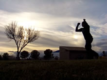 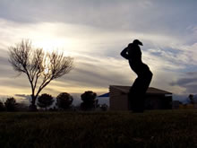

Start with a little run up for the front flip. You shouldn't have to travel more than 5-6 feet honestly. A huge run up is just going to make your technique worse, as well as make it harder to time everything. Take it easy. For your jog up, make the last step a very tiny hop into place: into place meaning with your feet together ready to jump.
Get your arms up and ready to jump forwards. Prep them up overhead in a manner as if you were going to dive forwards, and and over something. Well hey, you are going to in a sense, haha!

## Takeoff

* Jump Up and Out (Like a Dive, and High)
* Swing Arms Up and Around into Dive
* Emphasize Fast, Full Extension
* Do NOT Flip Yet

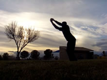 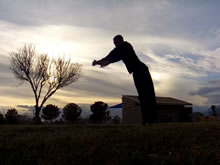 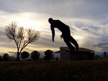

Ok, here's the ultimate killer of the trick: the takeoff. This is going to either make or break your Front Flip. What do you have to do? Jump! Jump jump jump! Do NOT swing your upper body down right now. You want to swing your arms forwards from over your head. Their swinging motion may create the illusion that your body is swinging down as you jump, not really. It's more like you're diving forwards.
If you look at the slides, you'll see that at the peak of the jump my body is FULLY stretched. Like a cat! Haha. You really need to get everything going up.
>### This is Awkward
>Yes, this motion is just extremely awkward haha. It just feels so uncomfortable. Usually at least; the faster you're running in the run up, the easier it feels. The slower you run up (or if you're just standing), the more awkward the jump feels. That's why it's best to visualize this as a sort of dive, or as if you're trying to jump up OVER a bar or a trash can or something haha.
I suppose this is just awkward when you compare it to the Back Flip. Why is this more awkward? Well when you're jumping up for a proper Back Flip, the technique is basically identical to a regular vertical jump. Your arms swing around from bottom to top, meaning they swing back as they come up. Everything goes back and up. In a Front Flip, if you try to swing your arms up normally like that, you're moving your arms against the flow of the rest of your body. Don't get me wrong, it's possible. But it feels weird haha. Find a way to make this comfortale for you!

### Dive!

Takeoff as if you're diving over something. In fact (and I'm going to reiterate this briefly in the Drill Box), drill doing that over and over. Do dive rolls (which for those who aren't gymnastically-versed, just jump up way high as if you're diving over a hurdle and into the water, landing on your hands first and rolling out of it) from a your Front Flip takeoff over and over. You need to get used to <b>setting</b> the trick. Finish the jump! Do NOT try flipping forward right off the ground. Jump first! Get up there! Practice practice practice this step. You're going to need body awareness so that you know when you have set the trick, and then you can move on...

>Get used to taking off high, quick, and adequately for this trick. Do lots of high dive rolls. In fact, it may help if you visualize jumping up and diving over something, or if you actually do have something to dive over! Go forward of course, but mostly go UP!

## Tuck

* Ok, Now Flip
* Crunch Into a Ball
* Bend Upper Body In Towards Knees
* Recommended: Grab Lower Legs for Tightness

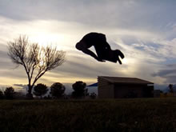 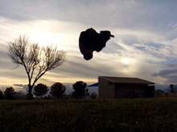 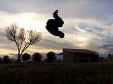

Have you completed the jump? Did it feel like you dove forward? Are you in the air? Did you make sure you didn't swing yourself down wildly yet? Did you wait an instant? Ok? It's tuck time!
Simply tuck. Squeeze everything in, trying to make everything as compact as you can. There's really not much to say. Bend those legs and knees in, and bring your head towards your knees. Grabbing your knees or shins can also help it feel more natural as well.
If it feels hard for you to tuck, it's probable that you started trying to flip during your takeoff. No! You need to go forwards when you takeoff yes, but you save the tuck until you're in the air!

## Untuck

* Open Up Your Body
* Extend Your Feet to the Landing

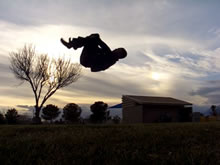 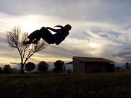 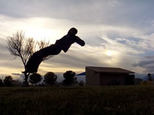

You can't see the ground as you tuck and untuck for this trick, so that is one thing that is going to make the timing a little more difficult. But you do need to until. There's not much explanation needed: simply open up! Ahhhh! Like a breath of fresh air, stretch back out! Really extend those feet into the ground!
>### Timing Notes
>When do you want to untuck? After all, I keep saying timing is important. Since this landing is blind, like I mentioned before, this is something that you literally are going to have to just time; you're going to have to establish the time to untuck simply by testing it out. You won't have any actual visual cues until it's too late!
I'd say, untuck after you can feel yourself fully tucked (in the last step) for an instant. Even tucking for just a little bit in the air (if done properly) will give you the rotation you need to get through the trick. Untucking will help you rotate that last bit into a good position to land, as well as and standing close to straight up.

Get a definite rhythm going for this trick in your head: Dive > Tuck > Untuck. Dive > Tuck > Untuck. Or, Jump > Flip > Open. These three essential steps do not overlap, but they do flow into each other. Practice!

## Land

* Land

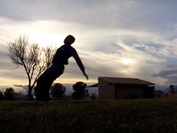 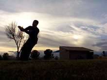

As I have a tendency to say: the landing here is a product off everything you did before it. When you first do this trick and you're not very used to it (especially when you're not used to the untuck), you'll probably land quite crouched or low to the ground, or something. But after you really get it going; once you get the rhythm of the steps established, and once you learn to takeoff high, you'll be landing straight up in no time!
>### Difficulty vs Complexity?
>At the beginning of this guide I said the Front Flip was one of the more difficult of the basics. Why? It's not really because the technique is hard. In fact, you may notice this tutorial has a lot less text than most. Rather than being a complex trick, it is difficult because the technique requires timing, and a somewhat awkward takeoff/landing. You need to work with the speed at which you do things from the takeoff to the flip; because a common tendency is to start trying to flip during the takeoff. Really watch for this! But I mean really, even with all this said, it's not <i>THAT</i> hard, ahaha.

Go out and have some fun! You may fall on your butt a lot when you don't have the takeoff or the timing right yet, but even so this move is pretty safe. Go get it!

