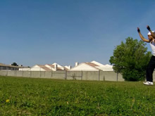

# Front Handspring
Forward Handspring

## Description

A Front Handspring is a basic forwards flip in which one swings one leg up behind them while bending down to the ground, then jumps off the other leg and pushes with their hand so they flip over forwards. It's a forward rotating flip using your arms to spring off the ground.
You can land it with both feet together (you usually do), or you can step-out and land one foot at a time. But your feet will come together at some point in the move.

## Moving In

* Start With Forwards Walk
* Step Forward With Pushing leg
* Reach Forwards for Ground

  

Start this move by take a step forwards or a few steps forward or whatever is comfortable.
As you can notice, the step into doing the move should spread your legs a open, with one staying behind and one going forwards and under you. Once you get better you can space your legs however much you want, but for a beginning it's probably better to try this out.

You want to now lean forwards and place your hands on the ground, basically under your head. Maybe like a foot or so in front of your planted foot, whatever feels the best. Don't try pulling your leg up yet.

## Pushing Forward

* Plant Hands Firmly On Ground - Arms Straight
* Kick Back Leg Up High Over Head
* Push Firmly With Base Leg

 

Now as you're basically making contact with the ground, beginning to pull your back leg up. Think of pulling it up over above you. Pull it up hard, and then once it's beginning to reach the top, push with your base foot. It's a very one too motion.
Remember, don't flip forwards too early.

### Where to Push Everything?

When you do flip as you push the "jumping" leg off the ground, you want to try to push forwards. Why? Well look at this. Your arms are fixed on the ground, they aren't going anywhere, so your upper body can't flip forwards, it's not going to move till it comes up off the ground. So, if we only pull everything straight up, that's not going to flip us over our upper body. So, we push everything forwards, so it goes over our head!

>If you want to drill the trick up to this step, practice getting all the way up, then falling into a bridge. Then get faster, the faster you go into the bridge, the easier it is to apply the following steps.

## Flipping Up

* Keep First Leg Pulling Forwards
* Swing Jump
* Push With Arms As Legs Begin to Descend

  

Now, all you can really do is pull your leading leg forwards and to the ground, and try pulling your back leg (it wasn't the back leg before, but it is now aha, even though it's in front of you at this point) towards your other leg. Remember, it's going forwards. You want to even try to pivot your body to shift your hips forwards, so they go past your head, thus flipping you over.

Tuck your head forwards as your legs pass over, think of tucking your chin into the top of your chest.
Also, make sure you complete the pushing (jumping) motion with the base leg from the last step before you pull that leg forward to catch up with the other one. If you pull it before the push is complete, you won't have enough momentum to complete the move adequately.
### Keep Those Arms Planted

Your arms need to stay planted on the ground for as long as possible. And the need to be straight. Keep yourself high on your fully extended arms! Don't let them collapse under you!

You don't want to push your arms off the ground until your feet both start to come over towards the ground. The pushing of your arms should be a complimenting motion, being helped by your legs flying over. You shouldn't have to push your entire body up with them.

## Land

* Land - Feet Together
* Optionally - Land One Foot at a Time (Walkover)

 

Nothing special here. Just pull your chest forwards, pull your legs down, and oh yea bringing your arms to the front might help you balance forwards. If you can't seem to get your chest up, you need to generate more force with your legs. Push and swing them forwards man! Do it fast!
Enjoy.

