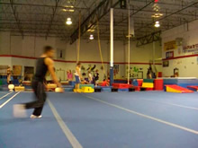

# Gainer
Gaining Back Flip

## Description

A standard Gainer can be any number of minor variations to the basic Back Flip which gains momentum by the swinging of one leg.

The Gainer is not <i>just</i> a "back flip off one leg."

The Gainer is not <i>only</i> a "back flip moving forwards."

The Gainer is <i>characterized</i> by the swinging of the leg for momentum. Often times "Straight Gainers" are the first recommended for people to learn. They're fun, and they help getting over the fear since they're the hardest to do well in my opinion. Sometimes people will do Gainers from a pivot set-up, called "Reverse Gainers" or "Pivot Gainers." Try whichever works with you, but the one I teach you is going to go straight forwards and gain distance forwards.
Gainers (mostly Gainer Flashes) are often swung into from other tricks like the Raiz and B-Twist.

"But but, the Gainer in your example video lands on one foot and you don't tuck." Oh dang! Well the technical principles governing what makes the Gainer a Gainer don't stipulate the kind of flip you must use (tucked vs untucked). The various methods of flipping also apply to standard two legged jumping flips, therefore, aren't unique to the gainer. Subsequently, the essentials of the Gainer technique (mostly just the take off) are the necessities for consideration in this tutorial.

## Straight Run Up

* Jog Forwards
* Plant Jumping Leg Further Forwards
* Gather Arms Back to Swing Later

  

In this particular tutorial I'm going to be doing the Gainer from a mostly straight run up. So to do this, take a few little jogging steps forwards. Don't friggin run for your life into this move. Just a few long reaching speedy steps to get yourself going.
Make sure that on you're that your last step in which you plant the leg you're going to jump off, that you stretch and really get your leg in front of you. Get your arms back and ready to swing up as well.
### Comfort With Straight Setup

Ok when doing the straight setup for a Gainer, you may be under the impression that it's only straight if you're taking a million steps in a perfectly straight line. Well, that's not always that comfortable. If you want, you can enter the straight setup from a slight or gradual curve. The thing is, just make sure that your last couple steps coming out of the curve are in a straight line. Ha! Beginners may want to disregard this little point as you may get confused. Just run into it however the heck it works for you.

But, don't only practice the straight setup. After you learn it, try it from a variety of setups, to become very versatile.
>### Why Stick the Leg in Front
>If you notice in my picture my leg is quite the heck in front of me. Why is this?
Well many people think that sticking your leg in front of you in any trick whatsoever is "blocking" and somehow magically converting your horizontal momentum into vertical momentum. Well that works to some extent, but you don't really block much momentum in this trick at all really. Your foot doesn't step hard and push into the ground that much, and it doesn't leave the ground that fast, so there is limited blocking of momentum in this case.
>
>Now, in the case of this straight forward moving setup the biggest reason to stick your foot far in front of you: well, first you'll need to observe a couple of slides in this example, namely the last one of this step where it plants, and the slide in the next step when this foot leaves the ground. You see, once our foot plants, our upper body keeps moving forwards since we have forward going momentum. So, at the moment of the jump (look at the last two slides in the next step), look at the angle between the foot and the body. It is just about completely vertical, going straight up. This means, the energy of our jump is directed straight upwards! Awesome huh? Our upper body and hips travel forwards above our foot, so bam, upwards jump!
>
>If we didn't put our foot out far enough in front of us, then our foot would be behind our hips when we jump, which means we'll be pushing forwards like / while we try to flip backwards...which basically means death for us. If we stretch it too far in front of us (or, if we don't keep moving forwards), our foot would be more in front of us when we jump, which means we can flip backwards all fine and dandy, but we won't move as far forwards.

## Swing and Jump

* Swing Back Leg Up Fast and Forcefully
* Swing Arms Up Quickly
* Jump Off of Base Leg
* Allow Yourself to Keep Moving Forwards As You Jump

  

><b>Note the angle at which the leg pushes off the ground:</b>
>
>
>
><i>As close to a vertical alignment as we can get...</i>

Now as you keep moving forwards, swing your leg (that used to be behind you) up! Swing it straight up! Kick the sky! Hiya! As you do this, jump! Push off with your planted foot, and push hard! In these types of moves your leg doesn't bend down as much, so you really have to make sure you push through the ground fast to jump up. Don't forget to! Try not to lean back a lot as you jump, but since you're going forwards especially, you do need to lean back just a little to be able to flip backwards. Swing your arms high upwards into the sky. Try to direct your energy straight upwards, visualize a straight vertical line going up into the sky that you want to push your body along.
### To Arch or Not to Arch

This depends on how you want your Gainer to look, or if you're too scared to not look backwards ahah. Most beginners tend to arch a bit as they jump. Generally, you don't want to arch too early, and usually un-arched Gainers are easier to make higher than arched ones. Even if you do arch, make sure that it actually is an ARCH and not a LEAN.
I arch in my example, that's comfortable for me. You want to practice being able to do it with your back arched and with your head neutral without an arch. As I mentioned in the outside, arching vs tucking vs whatever else are all matters dealing with back flipping tricks in general, and not with the specific Gainer technique. I'm only teaching the Gainer-ing technique here, so focus mostly on the points that I <b>do</b> bring out and not so much on the idiosyncrasies.
If you do arch, your head stays about the same height the whole way through, so try to get it up as high as possible, <i>before you leave the ground</i>.
>### Jumping without a Significant Leg Bend
>Now, in just about every other guide I tell you to dig down and then jump up haha. Well in Gainers and most of their variations, you don't get to dig down as much. And you don't really lean your upper body down at all. Now in some setups for some moves like Corkscrews or whatever else your leg does bend a bit more for the jump. But not nearly as much as most moves, and heck, most moves don't travel as high as Gainers and other tricks with the one-footed swinging setup. So how the heck do we go high if we hardly bend our jumping leg?
>
>Well, this is why it's important to visualize a <i>fast</i> (not forced) push into the ground during the jump, and to direct this jumping energy also. And, obviously enough, swinging the "kicking" leg up high. Not only does this drive your hips upwards, but get this: if you leg is swinging upwards hard, and you're extending everything up into the sky, that means that your jump doesn't have to push the weight of that leg upwards since it's already going upwards. So the swinging momentum compliments the power of your jump, as well as swinging your arms. You really want to just push everything straight up into the sky, even if you arch back or whatever. The more you push your whole body into the sky along with just generally pushing for that jump, the less work your jump has to do, which means more height for you. For these moves, I believe that getting extra height is not as important as just not being low.

## Flip Over

* Flip Backwards When Off Ground
* Use The Flipping Style of Your Standard Back Flip

  

Now you just flip over. Not too hard. Be sure to pull backwards at this time no matter what you do. Since this part is not really a part of Gainer technique and just deals with backwards flipping technique in general, well I'll go over the two major methods.
### If You're Tucking

I am not doing a tucked Gainer in my example slides. I'm just doing a random backwards flipping Gainer that simply demonstrates the principles of swinging up into any sort of gaining back flip.
But if you want to do a tucked Gainer, then simply do the same thing you would do in a Back Flip, tuck your legs in and up to your chest. Although your legs are inherently spread at least a little since you jumped off one foot and swung the other, you can still get them both evenly tucked up to your chest if you want to. Since you should already know how to Back Flip decently, I don't need to explain how to do this.
### If You're Not Tucking

If you're not tucking, it helps to look back now. For example, I am heavily arched in my example slides, and this helps carry my body around. Since my back is arched, and I've pulled back, my hips now want to come weeee over my head, and return my spine to it's natural straight alignment. Still, pull your hips forwards. If you want, you can keep pulling the leg you first swung up too. Just flip backwards dang it! If you can already Back Flip easily it's not hard at all, whether you tuck or not.

## Land

* Land Out of the Flip

  

Now Land. Well, the technique of the Gainer that needs to be taught ended a couple steps ago, so let's just discuss the back flipping landing theory a litttttle more.
### If You're Tucked

If you're tucked, untuck like a Back Flip. No explanation for that necessary.
Don't untuck too early though, cause if your legs open up and land too far behind you, guess where your face is going? FLOOR TIME.

Generally try to pull your legs under a little you before you untuck, and as you untuck. Get them to land below you. It really helps if they bend a little as you land or before you land, because if they're behind you at all and they're totally straight you're going to stumble forwards.
### If You're Not Tucked

Well, I guess you can still land on both legs if you want, just simply direct them both to the ground together. Just pull them forwards under your, it's very similar to what I talked about under "If You're Tucked", only instead of untucking, you're just pulling them forwards. The same principle about bending them a bit applies.

In my example, I land on one leg. Just pull that leg to the ground. Bending principle applies. Let the other leg trail behind, and use it to balance out your landing after your first leg lands.

There's nothing too it! Just land! If you can do all the other steps but can't figure out to land...dang. Haha.
Just do it!

