# Jacknife
Jackknife

## Description

The Jacknife is a very powerful and cool looking trick indeed. What it basically is is a 540 kick with a hook kick hitting the target again as one lands. A 540 followed by another outside kick before landing! Or a Tornado kick in which one spins into a hook/wheel/crescent before landing, etc. It's fun stuff.
Some people view the Jacknife as a variation of the Cheat 720. I believe it's very helpful to know a good Cheat 720 before, but it's really just a variation of the 540/Tornado. Many people try to do it like a constantly spinning Cheat 720, so in reality their first kick is just a flail of the leg, and not a distinguished kick.
The Jacknife has two full kicks, one inside kick followed by one outside kick. It's pretty awesome.

## Cheat Setup

* Perform the Cheat Setup

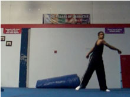 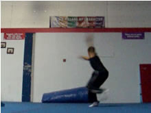 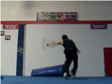

The infamous Cheat Setup. By now you should have a bangin' 540, which means you should have a bangin' Tornado kick, which means I shouldn't have to explain this.

I'll add a few notes though. You need a very, very good 540. Like, a wonderful 540. Even with a marvelous 540, getting a Jacknife will take some time. This implies you need to be able to do the Cheat setup very well. The setup should be quick, fast, and you shouldn't have to think about it too much. It should be ingrained in your muscle memory by now basically. So yes, do it well. And try to do it fast, but not so fast that you compromise the technique.

## 540 Takeoff

* Perform the Takeoff Like a 540
* Emphasize Speed and Jump

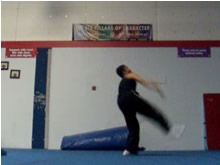 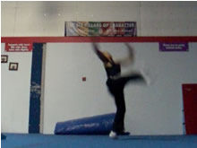 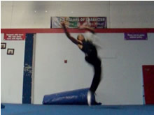

Again, something else you should already be quite familiar with by now. The takeoff should be very quick too. Make sure your jump is very quick and distinguished.

For the Jacknife, you're really going to want to get lots of flat spin out of the setup. Rip those arms sideways over and past your target as you jump, trying to get lots of turning momentum. Keep your eyes on your target though. You want to torque your body, but keep your eyes spotting the target as you go up.

Fast!

## First Chamber

* Stay Fixated On Target
* Bring First Kicking Knee Up
* Do It Fast

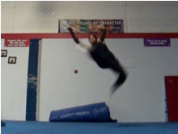

Another 540 prerequisite step. This usually comes pretty naturally, but for a Jacknife it can help if you emphasize the chamber. This technique is very fast and powerful, so a deeper, concentrated chamber will help speed up the first kick.

>### Be Careful
>Don't allow the chamber to become the kick of the move. If you consciously bring up the chamber with the intent of <i>then</i> kicking it into an actual kick, your technique will be greatly improved! And people won't laugh at you!

## Inside Kick

* Fully Extend the First Kick
* Do It Very Fast, and Fully
* <i>Optionally</i> - Chamber the Non-Kicking Leg Here
* Allow Arms to Open for Kick

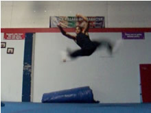 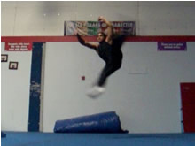 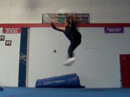

And here's the first kick of the trick. A kick similar to that of a 540. So you should know how to do it. Some say to think of the kick more like a Tornado Kick. Interesting indeed, eh? The visualization of the kick isn't a matter of technique, I can't teach you exactly what to make it feel like, you just have to feel it.

However, many people end up screwing this kick over a little, not kicking it to full extension at the peak and such. So I'll talk a little about it. First of, this is why it helps to have a deep chamber before, it makes it easier to snap it up to full extension! And really focus on full extension here. Many people compromise the first kick because they're anticipating spinning around into the second kick. Don't! Make it a point to emphasize the first kick.

### More on Over-Anticipation

Do you notice how my body is just slightly tilted sideways at the peak of the kick, but it's still oriented forwards? Yes! Many people end up having their hips/chest oriented a lot further past the target, even behind them! This usually ends up in their kick not being able to come out right, or to full extension. They're too busy trying to spin into the second kick before they finish the first kick!
Finish the first kick man! Keep your body in the right position to throw out the first kick to full extension, don't rotate while you're kicking. Rotate in the position you're going to kick, kick, and then spin around and do the whole blah blah.
It's a real fine balance and timing issue you have to get down. If you wait too long after extending the first kick, your second kick will come out late and uglier. If you wait too short, your first kick probably won't reach full extension. What's a good way of solving this problem? Practice fully extending your first kicking faster and retracting it fast, ha. This can be done by practicing that in <i>both</i> the Tornado Kick and the 540.
>### When You're Ready
 
>When you've got the move to a point where you've stopped over-anticipating the second kick, you can focus on chambering the lower/second-kicking leg while your first leg is reaching full extension. Don't rush it though.

## Rechamber and Spin

* Start Re-Spotting Target - Spin
* Wrap Arms Fully
* Chamber Second Leg (Sometimes Automatic)
* Let First Kick Drop Straight Down

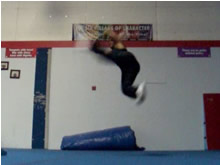 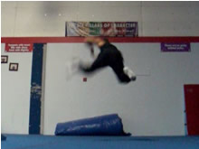

Now here comes the tricky part; here comes the part that makes this a whole lot different than a 540. Not only does your first kicking leg have to land, but you also have to now spin around and spot the target again, and chamber up your second leg to throw out the second kick.

### First Kicking Leg

Now, I'm going to assume that you tried to throw out a good kick. A really good solid fully extended first kick. Giving lots of power to the first kick makes it harder to spin around and do a good second kick, right? That's why some people with crappy first kicks can do really good second kicks. But we did a good kick, RIGHT!?
So now, you want to try to just pump it down to the ground. Don't try to complete the kicking arch from the peak to the ground in a circular fashion now. You want to focus on kicking as hard and well as possible until you reach and slightly pass the target, but from here you want to try to drop it. You can even let it bend or pump it a little at this point.
You can do this as a drill, which I'll mention in just a bit...
### Body and Head

From here, wrap your arms, spin them hard. You're actually going to almost do a twist here. It just doesn't seem like a spin or a twist cause your legs are all sprawled out hahah, but you are spinning around to do the kick. Think about looking back around at your target, and really torquing your body and your hips over so you'll be able to throw the kick out in just a split second.
### Second Kicking Leg

If it hasn't started chambering already, close it chambered really quick now to get ready to explode into another kick!
>### Changing Up the 540 Landing
>Remember how I talked about with the first kicking leg, how you can just sorta drop it down to the ground after it extends and peaks at the target? That is, opposed to swinging it through the rest of the kicking arch all the way into the ground?
>
>Practice doing regular 540s, but doing just that. Do the 540, peak the kick (at full extension on the target, DO IT), and then instead of swiping it down through the kicking arch to the ground, sorta cut it's rotation and just pump or stick it down towards the ground, and spin into the landing to spot the target again. A slightly modified 540 to use for the Jacknife, yes? In this respect, some people say to visualize it more of like a Tornado Kick which switches legs, and not as much like a full 540 kick.
>
>You don't <i>have</i> to go about it that way of course, but it may help.

>If you plan on drilling only up to this step, it may seem just like a regular 540. However, when trying to build up this trick step by step, drill what I put in the above box "Changing Up the 540 Landing."

## Second Kick

* Re-Spot Target
* Turn Fully To Be Able To Kick Target
* Fully Extend Second Kick
* Land On 1st Kicking Leg as 2nd Kick Peaks

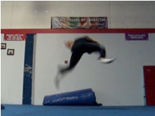 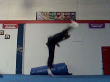 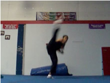

This is the only major part of the trick which the Cheat 720 helps with: completing the small spin into a big strong hook, wheel, or crescent kick. Torque your chest and hips all the way to the necessary position, and make sure you heavily spot your target over your shoulder as the kick is coming out, even before if you can!
You can use a hook, wheel, crescent, or crescent/wheel hybridish kick. I'd recommend just using the same kind of kick you usually use for a Cheat 720. I wouldn't try to go for an outside crescent though, stick with the hybrid (or an actual hook/wheel). Doing an actual crescent means your hips now need to face the target which means you need to spin more. But yes, this is a moot point.

Just kick! Hiya! How good your kick is depends on how well you've gotten yourself into this position! If you're having a lot of trouble getting the kick out, definitely <b>go back</b> and only do the first steps of the trick. Do them to perfection, fix whatever in these steps is causing the problem in the latter part of the move. If you're doing everything before this right, the kick should come out very naturally!

## Finish

* Finish Second Kick

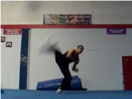 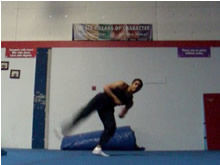 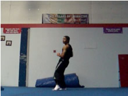

And land! There's not much to this, just let the second kick finish it's arch and then wind up back in a solid position. Good times!

