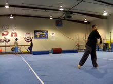
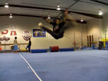

# Parafuso
Cheat Double Leg

## Description

The Parafuso is can be described as many things: a Double Leg from a Cheat Setup, a Tornado Kick where you bring both legs together in a Pike, etc. Once you can 540 well and with ease, the Parafuso is then actually quite simple. Excellent! There's not too much too it, and it's not drastically different, but it does open us up for more varieties in our arsenal and combos. It's just a nice little trick to have!
>### "But Isn't a Parafuso...?"
Ok, I've heard about ten million different tricks called Parafuso, from 540's to B-Twists to Corks...someone somewhere calls each of these a Parafuso ahaha. Regardless of whether it's a misnomer to the roots or not, the Parafuso in <i>tricking</i> is the trick described in this tutorial.

## Cheat Setup

* Perform the Cheat Setup

 

You know the drill! If you can do a 540 well, and land it standing straight up, then your Cheat Setup is adequate enough to Parafuso. Just do it fast, make sure you dig, get those arms ready, and get ready to goooo!

## Takeoff - Straight Leg

* Take Off Like a 540
* Bring Your Leading Leg Up Straight and High

  

This step is pretty much identical to the 540 as well. There's but one change though, the initial leg you lift up must be straight, and it must be high! Pretend that you're doing an outside crescent kick with it in fact. Kick it way up there as you takeoff.
Don't let focusing on lifting the leg up compromise the jump of your Takeoff; you must still perform the entire technique of the Takeoff firmly and quickly. Throw everything up!
>Some people, like me, will naturally lift their leg up straight when they 540 anyways. Granted, when I lift it for a 540, it's not usually as high as for a Parafuso. But yes! If your habit is to bring the leg up bent, well this works great for the 540 and Cheat 720s and 900s and such, but you're going to have to make sure you're straightening it out for the Parafuso. It isn't hard. See drill box for more info.

>To get used to this Takeoff, practice simply doing the Takeoff while kicking the leg up, and then landing. You'll be landing on the leg you kick up, and you don't do anything with the leg you jump off of. Drill that! The pseudonym or it (if it helps you understand what to do) is the "Cheat Hyper 360" haha. Get used to getting that leg up straight there, with no rush to "Double Leg" it. Then, when you've adapted to that, add the next step on..

## Piking

* Hold Leading Leg Straight
* Kick Trailing Leg Up
* Pull Legs Together Into a Pike

  

Now comes the part where you Pike or "Double Leg" the legs together. It's very straight forward. Bring the leg that you just jumped off of up to meet the leading leg in the air.
Your leading leg may have a tendency to want to bend at this point, since that's what it does in a 540. Make sure you tell your body to keep it straight! Hold it up there!
You'll notice, this is basically just a 540 with your leading leg straight, instead of tucked under you. This creates quite a different feel and aesthetic, but the technique is very similar; use that to your advantage!
If you find it impossible to bring your kicking leg up, or you fall down when you try to: think back to the Takeoff for the 540. If you try to kick before you've set (completed the jump), you fall and the kick is hard to do. So here, if you kick/pike too early, before you set, you will fall.

## Land

* Hold Legs Piked Together
* Land Naturally

  

Simple landing here. Hold your legs piked together for maximum effect! Haha. Just let your legs carry you into the landing. Those two legs you had piked in front of you turned into a massive single unit, and now it's going to give you massive lateral momentum upon landing. What are you going to do with that momentum? Use it to Takeoff quickly into a Backside trick? Just let it carry you as you simply finish landing? Well whatever you do, you have the satisfaction of having done a lovely Parafuso!
>### Should You Know the Double Leg?
>You notice how I have not listed the Double Leg as a prerequisite for this move, or referenced having to know the DLeg anywhere in this tutorial? That's because you don't have to! Haha. In fact, I'd honestly recommend learning this before the DLeg, but it's all a matter of personal choice, of course.

