# Raiz

## Description

Ahhh, the Raiz is a fun and strange yet useful move. In a Raiz, you swing way up and turn over. You kick one leg up while arching over and back, and then dig that same leg you swung up back into the ground. It's almost like a fast powerful wheel kick, only you jump with it.

A Raiz is always inverted: this means the hips always pass above the head. However, there's two main distinguishable types of Raiz: high and low. Wow, clever titles eh? In the high Raiz, your chest is high, your head is high, and you basically float upwards as you kick up into the Raiz, it's done at around head height, and slanted. In the low Raiz, your chest/head is lower and your legs basically pass directly over your head, making it just about totally flipped. The higher version is better for technique building and learning advanced variations, and the lower version is easier for very fast swing through or combo. I say the best one to use for combos and swing throughs or whatever is right in between, combine the speed of the lower Raiz with the slant and height of a higher Raiz by proceeding with a hook, or just not lifting your chest up to float as high. It's complicated to explain, so please view the tutorial!

## Setup and Dip

* Pivot and Step-In Towards Direction of Travel
* Prep Arms Back for Swing
* Dig Onto Front Foot
* Tilt Out, Keep General Orientation Upright

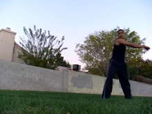 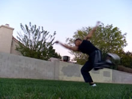 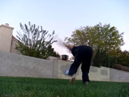

Ok, there a two major setups specifically for the Raiz and some of it's variations. One is the standard setup used in Capoeira, which is almost like a step backwards around into the Raiz. This is good for the lower version of the Raiz, and for it to be very speedy, although this setup is hard to get a feel for. You can find other tutorials or examples of this in other videos. I teach the setup where you take a step in.

Regardless of what you do, get your arms winded up in whatever fashion and ready to swing. You don't have to have them wide open, but that might help you when first learning this. Just remember, the wider they are, generally the slower you can setup. Setting up slow can assist you greatly when first learning.

Don't forget to pivot over.
### Step In

Many people are under the impression that a Raiz needs a cheat setup when you do the step in type setup. Well, you can if you want to, it doesn't matter. But you can setup however you want, if you follow a couple principles.

What you want to do, is shift your weight onto the leg you're going to jump off of. And bend down as you do this. Just as you would for any vertical jump, make sure the leg you jump off of is bent when it pushes into the ground.

Generally you want to set this up fast, pivot in the direction you want to flip over towards as you do this. Have your foot facing past this direction as well.
This move is usually done on the opposite side of your Aerial of course, with the opposite foot than an Aerial in front. With that in mind, I'd think of the setup of this move like <i>pivoting into an Aerial's setup</i>. As opposed to a standard Aerial setup, where you step straight forwards, in this one you rotate laterally down into it. In the Raiz setup, you want to stay a litttle more upright when you bend down though.
### Where to Pivot To?

Now for some people, especially beginners, or those looking to pump up their Raiz, this is an essential point.

How far do we pivot in this setup? Is it just a Cheat Setup? Nah, but close. You see the 'stance' I start off in, right? I'm facing 90 degrees away from the direction I'm going to travel. So when I pivot into the setup, I want to pivot not to face behind me, no way. I want to pivot and tilt <i>towards the direction I'm going to travel in</i>. You see?

It makes sense. If we go all the way back behind us like a Cheat Setup, our hips are going to be farther ahead of us than our upper body, meaning that it's greatly easier to have your Raiz end up uninverted. No, you want to pivot so your foot and hips are facing towards the direction you're going to travel in (sliiightly past is ok), you want to have your head facing in that direction, and you want your upper body to tilt (depending on how much you dip) towards that direction. You do NOT want to try to get facing back behind your original stance like you would a 540. This is a crucial piece of information that makes the Raiz not only easier, but easier to do <i>well</i>.

## Takeoff

* Turn Over Into a High Arch
* Start Looking at Ground Behind/Under You
* Jump Up Quickly and Firmly
* Swing Arms Around
* Swing Leg Up Skyward

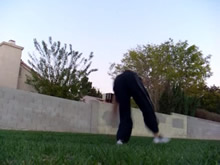 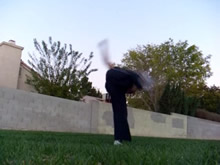 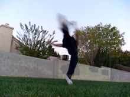

Ahh, the takeoff, this is the definitive part of a Raiz. This will make or break your Raiz. There is one crucial step you need to do here, a couple principles to follow, and then a bunch of different things you can do. These are all dependent on the various styles of dipping I talked about before, and the kind of Raiz you want to do.
### Kick Up

KICK UP. I played a lot with what direction to swing your leg up in, and I decided the best is to pull it up back behind you. Even if you pull directly up behind you, it will still end up being led in front of you when your hips turn around, so it's all good. Plus, swinging it backwards pulls a lot of torque into it, GLUTEUS MAXIMUS!
### Arch Back

Don't lean your whole body backwards now, but do tilt your head far back and look at the ground. This is a requirement for a Raiz. To help with this, push your chest upwards while tilting your head backwards, you want to arch, but you want to still go up. This leads into my next point...
### DO A FLIP

That's right! Don't try to do a side-to-side motion. Don't think of it like a Tornado or 540 where you're turning from the front to the back like some sort of side to side turning motion. It's a flip! You want to turn over yes, with a very forceful arm swing (talked about later), but first and foremost you want to jump into a dang flip! The flip is going to be directed along the direction of your momentum (the direction you're traveling in), so flip towards that direction.

This is especially important if you want a high floaty and yet inverted Raiz, flip! It's like a Flash Kick, as I talk about all the time. Or, some would say it's like an Aerial, in fact it's quite like an Aerial. With a low Raiz, it's easy to do it just like an Aerial, but for a high Raiz, you need to think of it like you're hmm, flipping over something!

Like there's a bar in the direction you're moving, right at your neck's height, and now you need to jump over it, stretch over, turn so your back is facing it, while kicking your leg up quickly and straight into the sky. Do it!
### Jump

Don't forget to jump, push through the ground with your foot quite fast.
Swing your arms up too and around too. They should flow in the natural circular direction that uhhh, they were flowing in? Swing them around, but also up into the sky. Actually, either way works, because your upper body is turning over, meaning swinging them laterally will pull them into the sky, or swinging them into the sky will swing them laterally, good deal!
### Higher Raiz or Lower Raiz

If you want your Raiz to be quick and low like an Aerial...mimmick the takeoff of an Aerial more. This is going to override something I told you to do in the last step: "Keep General Orientation Upright." If you want to do it quick and low, lean outwards during the <b>setup</b> more, like you would an Aerial. Your chin is still up of course but your body a little lower. If you want to it be high and floatier, lean out a little less and keep everything closer to your center, so that your body is coiled a little more like an upright spring, and not tilted out as much.

## Pull to Landing

* Pull Leg Straight Forward into Landing
* Open Up Chest By Opening Arms

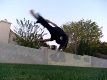 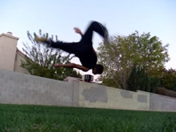 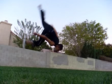

So now we're in the air, turned over, our arms have been swung, and all that YAY. So uhh, what can we do now? Not much really. Just a couple things.

For one, pull your initial lifting leg down into the landing. Like really, do this. Right after you pushed for the jump, pull your initial lifting leg down straight in front of you for the landing. Lead it down to the ground, this helps a lot when it comes to swinging through. This is especially the case when you do the higher version of the Raiz, because since your higher in the air your legs tend to just lag up there a bit, so pull that one down into the ground!

Also, if you want to control the landing more, particularly for swinging through, open up your arms. This helps keep you from rotating laterally much, as well as helps you to balance. And not to mention, if your arms are open, you'll be able to swing them up into another trick.

## Land

* Pull Into Landing - Leading Leg First

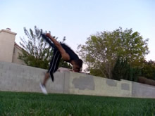 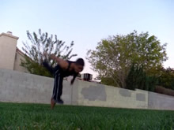 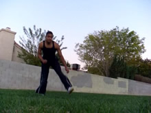

Keep pulling into the landing.
And uhh, that's basically it. Do whatever you want from here. There's no real advice to give here because your Raiz is generally dependent on how (well) you takeoff. So give special attention to that part. Have fun kids! It's not as hard as you may think.

