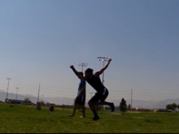

# Sideswipe

## Description

Many have said a Sideswipe is many things. It's tough to say exactly what it is, it shares a likeness with many tricks, yet differences between those tricks as well. Some say it's an inverted 540. Some say it's a Flash Kick mixed with a Raiz. Some say it's a 540 mixed with a Flash Kick. Some say it's a Raiz switched. I'd say all of those are just about it when mixed together, but the Sideswipe is also sort of it's own move as well.

You take a step in and pivot, then jump off one foot while turning over over and arching back, then the kicking leg swipes over the body into the ground. The hips must <i>always</i> pass above the head level, even if it's only slightly, otherwise it's not really a Sideswipe. The back should be arched into the trick.

I feel as if Sideswipes are one of the most common moves today that are not done to their full potential by many people. It seems people tend to lean themselves down towards the ground and desperate swipe to land the trick without dying, with a low chest and bad form and such. Good effort, but that will surely be a hindrance to your later Sideswipe variations. So I will teach you (hopefully) how to do a nice clean Sideswipe, that is up around your maximum height, while still being inverted and with a nice powerful swipe! I will try to get a better angle for the example slides/video.

## Precursor

I've experimented with this move a <i>whole</i> lot, trying to find the best way to do these way high and stay inverted and look good. Now in my Raiz tutorial (which I recommend you read, and already know how to Raiz well) I talked about the variety of Raizes, high and low, floaty and fast and all that, and how they all have different uses. Well, I'm only going to be talking about the high, "best" type of Sideswipe in this tutorial. To be honest, it's the only useful one in my mind. It's done high, it's done inverted, the kick goes high above you, and you land high. This not only looks wonderful, but it allows you to easily progress onto later variations. So I'll simply be talking about how to do this trick in the way I feel is the absolutely most useful, and the best. And, it's not that hard.
If you can't already, I highly recommend learning to do a nice, arched Flash Kick...you'll see why. If you want to learn to do lower or more flipped Sideswipe, just experiment with it after you learn and see what works.

## Step-In

* Step-In Like a Raiz
* Keep Body Aligned Mostly Upright
* Lift Arms Back for Momentum

  

People set up many different ways for a Sideswipe. Most do it like a Raiz. I'll say you should do it sort of like that, but there are a few changes you'll want to make for an effect set up for the Sideswipe.
Remember, this move doesn't require that you do the Cheat Setup; if you can just shift your weight onto one leg while pivoting over a bit, you'll be good. So just pivot over a bit and shift weight onto the leg you're going to jump off of and kick with. Bend down a little, bending more with the legs and less with the upper body, while doing this. Basically, do the Step-In setup, which is described in greater detail in my Raiz tutorial.
### Dipping For An Effective Jump

Now when it comes to the Raiz you don't really <i>need</i> to go upwards that much if you want to do many things, but as I talked about in the precursor, this is a little different than a Sideswipe. In a Sideswipe, you want to go up, and do the trick around shoulder/head height.

To that end, dip like you would a Flash Kick, but while shifting your weight onto one foot that you pivot onto. Think of mixing the two motions together. Remember, when you dip for a Flash Kick, you don't lean down much and lower your chin down; instead you coil downwards, bending your legs (important, so you can actually jump off of them), keeping your upper body in alignment with your hips orientation, and keeping your head/chin up. So do all of that for your dip, think of just doing a Flash Kick from your little pivot or step-in set up. You can lean out a little bit if you want to though, it's no biggie, and it might even help.

One of the biggest things that helps you stay up is keeping your chin up as you dip, try not to look at the ground as you set up. Why? Because if you look at the ground, this means when you takeoff, your head will have to pull back to arch, which in the case of a trick like this, keeps your head where it is. If your head is already pulled back to some extent (since your upper body will be leaning forwards), then it doesn't have to pull itself back as you takeoff, meaning it will stay higher...

>### Understanding to Draw from the Flash Kick
>I came to an understanding one day of just how important it is to use the knowledge from a powerful arched Flash Kick for this trick. Many people understand that this trick is like a Raiz and a Flash Kick, but only seem to take into account the actual swipe/kick used and arching when it comes to doing it a Flash Kick.
>
>But think of this. Ok, many people are under the impression that doing a nice high but still nice Sideswipe takes ooooh so much practice and training and skill, right? Well, why should it? Think of the Flash Kick. Not only do we arch into the jump and swipe the kick down, but our hips pass above our head height. Not only do they pass above it, but they also completely <i>flip</i> over our head! So if we can get ourselves to flip and arch and kick and all that around shoulder/head height, why can't we do that for a Sideswipe. Well: we can. Since the arching, kicking, and jump of this trick are so similar to that of a Flash Kick, it's important to also utilize principles from the dip/setup of the Flash Kick. This move is essentially a Flash Kick with flat spin that pivots and jumps off of one leg. Many people realize that your kick should come down like a Flash Kick, but it doesn't seem as many realize that using elements from the Flash Kick setup can help a lot as well!

### Arms

I've talked a lot about mimicking parts of a Flash Kick setup, but I'm going to say not to quite mimic the arm motions. Try to make your arms motions similar to a Raiz.

## Takeoff

* Jump Straight Up
* Swing Arms Around
* Arch Upwards and High (Flash-Kick-Like)
* Spot A Target Behind You

 

Now comes the next part of the Sideswipe, and this must happen fast. Jump up fast off the leg you planted. Focus all your energy upwards. This can be hard, since you're leaning out a little during the setup of this trick, but visualize it that way anyways. Focus the flow of power from your jump in a vertical line from your foot to your hips, and even up to your chest. This is why it helps to A) have your hips directly above your jumping foot (with your jumping leg bent enough to jump off of, of course) and B) keep your chin up and dip like you do in a Flash Kick. You see, in a Flash Kick... or heck I should just say in a vertical jump. A Flash Kick takeoff is just a Back Flip takeoff, or vertical jump in general, the only difference is you need to arch into it. But yea, in all those jumping motions, your body is aligned in a way so that it extends straight upwards. So during your setup (previous step), you want to make sure your body is in a comfortable position to extend upwards, while still being able to jump off one foot and arch back.
As you takeoff, you want to pivot over in the direction you pivoted during your setup a bit. It doesn't have to be exaggerated, it's pretty natural if you can already Raiz.
### Non-Kicking Leg

You don't want to pulllll and streeeetch that leg up there as hard as you would for a Raiz generally. This is what I would always do at first. It's doable I mean, it won't make your height or arch suffer or whatever, but it increases your tendency to keep your non-kicking leg straight as the kick passes over until the end. I find this doesn't look as good, so just focus on a quick burst of energy and pull that leg back. That's my recommendation anyways, to quickly yank it behind you, but any direction out towards the side or whatever should be good. It's not how high you pull the non-kicking leg that makes this inverted...
### Arch

Without pulling your back downwards, or pulling yourself or your head to the ground, just think of (while keeping your chest and such up), look at a spot on the ground behind you. Similar to a Flash Kick, eh eh? Looking behind you to create the arch...Remember though, don't let the arch compromise your jump. Be sure to arch into the jump, in fact this is why in the setup I suggested to keep your head back and chin up (same thing actually) when you setup, so when you arch, you don't have to throw your head that much.
>### How is this Horizontal?
>That's what you may be wondering. If we're trying to do this like a high Flash Kick from our pivot setup, how come we don't end up flipping around totally inverted like a Flash Kick, and instead we end up horizontally aligned? It's because you A) pivot as you setup/takeoff and B) takeoff one foot while spreading the other one away. You see, like with a Flash Kick you're envisioning flipping and arching towards one direction, right? Your body keeps flowing in that direction, but since you're pivoting on one leg and the other is off the ground (and pulling itself), you turn about 90 degrees or so away from the direction you're "flipping" towards, so you stretch out sideways. Ok, did I just confuse the living crap out of you? Because I confused the living crap out of my self with this too haha. Ok, I still need to think of a way to explain this. Just know this: if you do these steps, it WILL be inverted but will also maintain the horizontal-esque look of a lovely Sideswipe. Yay!

Swing your arms up into the air and around. If you swing them laterally around your body, they'll end up subsequently flying up into the air anyways since you're going to go horizontal haha. Just throw those suckas into the air baby! Don't let them lag behind.

## Swipe

* Swipe Leg Quickly Towards Ground
* Bend Non-Kicking Leg Back

  

Ok, if you've done the steps before this well, and done a nice fast jump off the ground and reached into the air.
Now comes the time to swipe. Swipe immediately as soon as you leave the ground. I don't know many people who use a heavy chamber on the kick, but you can play around with it if you want. Just remember, the sooner you swipe/kick, the better usually. Especially if you've done this all well and are now up in the air around your shoulder/chest level.
Swipe to the spot on the ground which you should be looking at. And lead the kick with the front of your foot. Don't try to kick it so it strikes with the inside of the foot like a 540 or some crap, eww that looks ugly. Lead the kick straight down BAM fast, like a Flash Kick, eh eh?
### Non-Kicking Leg

What you do here with the non-kicking leg doesn't make much of a difference technique-wise, but it does look wise. Bending the non-kicking leg back before/during your kick looks excellent. I never used to do this, and I always thought "man that looks sort of ugly." Don't wait until you're about to land to pull the kick back, try pulling it back now! You may do it naturally and not have to think of it, good for you. If you don't, I wouldn't worry about this step until you can already Sideswipe reasonably well.

## Finish

* Land on Swiping Leg

  

And you're done! You come out of the landing like a Flash Kick with a flat spin. Hey! That's similar to what this is, eh? From here you can do any other trick that you would do out of a 540 or Hook or anything. This trick is very fun to do when done high and powerfully! Go do it right! Yay!

