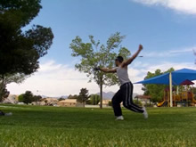

# Tornado Kick

## Description

A Tornado kick is the most basic trick from the "Cheat Setup". It is a jumping spinning inside kick. The kick thrown can be of the type Inside Crescent, Round, Roundhouse, or Front. From a position facing the target, you pivot around behind you while digging down for the jump. You shift your weight onto the foot you're going to jump off of while pivoting. Then you proceed to turn towards the front, towards your target, and jump, as you do this, you lift your non-kicking leg up. This is basically the "Cheat Takeoff", a vertical turning jump from one foot. As soon as you have jumped, you kick forwards towards the target with any of the aforementioned kicks. You then land on the non-kicking leg, the leg you lifted up first. You'll see certain stylistic variations of this movement in certain forms of dance and other arts as well. Let's do it!

## Cheat Setup: Pivot and Dig

* Spot Initially
* Pivot Jumping Foot into Backside Stance
* Dig Down and Shift Weight Over Jumping Foot
* Wind Arms Back

  

### Pivot Around

Remember, the target is in front of where we're facing at the beginning, right? And we want to spin around and jump and kick it and all that, correct? So, for starters, we need to turn around. So think of shifting your weight from the leg you're not going to jump off of, onto the one you're going to jump off of, while pivoting around.

One thing most beginners don't get is the pivot. How far do you pivot? Basically, you want to <i>pivot into a far sideways stance.</i> What do I mean by far sideways? Well, you can reference the Pop Setup for what I would call the plain sideways stance. You have your hips and body facing about 90 degrees off the target for that stance. So for the "far" sideways stance, you want to pivot 180 degrees more than that, so you're 90 degrees off the target, but in the other direction. (This stance is actually called the Backside Stance). The difference between this and the Pop Setup, is that in the Cheat Setup you're only digging one foot into that stance and shifting your weight over it, just let the other foot help keep balance and such.
>### Make No Mistake
>Since the Tornado Kick isn't that hard to do with all kinds of goofy setups, lot's of people get into the habit of doing some pretty awkward looking setups, setups which hurt them when doing advanced variations. So be sure to watch yourself, and watch your pivot. Don't just spin around then try to jump, shift your weight over to your jumping leg, and emphasize that you plant it firmly. This moves us into the next tip...

### Dig, Dig, Dig!

As I will talk about in just about every single one of my tutorial ever, you need to dig in order to jump. That's basically the way the universe works. You need to bend your legs (and subsequently, whole body) down so you can then extend your legs and push you up, ok? So, you want to definitely do that during your Cheat Setup. We want to dig so we can then jump! This is important for a Tornado Kick, but even more important for advanced variations where you <i>need</i> to use your maximum jumping power.

So how do we utilize this standard dip/dig in the Cheat Setup and Tornado Kick? Well, remember we're pivoting around and shifting your weight onto one leg. So, would it not be beneficial to bend that leg we're putting our weight on? Yes, it would! Dig into it. Don't just lift your leg over the ground and then put it back down, really dig into that ground.
### The Arms

Open your arms up in whatever fashion is good for you, just as long as they're up high enough; at least chest level should be fine, depending on your goal (will talk about this later). Since we're going to be turning around one way, might I suggest also bringing them over towards the opposite side of which you're turning (view example slides/video), so you can then swing them towards the side you want to spin to?

## Cheat Setup: Jump and Turn

* Spot Target
* Lift or Swing Leading Leg/Knee Up
* Swing Arms Up
* Jump Quickly and Distinguishably

  

Now, remember how in the last step we dug down, which means that our leg(s) bent. So we can jump off of them. Or in this case, we're just going to be jumping off the one leg. Now comes the time to jump. So jump, and visualize the jump going straaaight up.

However, while you jump, make sure you're turning over to look at the target. Spot the target ASAP. Swing your arms around and up to help turn your body as well. Just generally think of trying to get your whole body to face the target.

Make sure that your turn and your jump are done simultaneously, and don't make the mistake of only turning and not jumping, you need to do them BOTH.

>### Arm Motions for Different Results
>Now in tricks using the Cheat Setup, which remain relatively vertical and have a kick, where you throw your arms as you takeoff can make the trick feel quite different. You always want to lift them up from the bottom, but how much, and in what way?
>
>If you lift your arms <i>around</i>, as in, as you lift them up to around your head/neck level you focus on pulling them around over and past your target in a circle, you'll have more lateral momentum, or "flat spin" on whatever the Cheat trick is. If you throw them up, as in, while you turn over to the target you just reach for the sky as you jump, you have less lateral momentum, which can sometimes help control the exit or landing after the kick more. Neat, huh?
>
>Which way should you do it in a Tornado Kick? Either way is fine, throw them up to not rotate as much out of the landing, or throw them around to get a nice aesthetic lateral spin a going. It's good to practice both ways, although throwing them mainly around is more useful in later variations, and in fact if you throw them up and not around, can hurt later variations. Just a nice little tip!

>Practice simply performing the setup and the takeoff to the best of their ability. Work on getting the rhythm down and being able to jump and turn adequately.

## Chamber

* Bend Kicking In
* Bring Kicking Knee Up

After you've fully extended your jump, bend your leg to however much is comfortable to throw a nice kick out. Honest, it doesn't need to be a whole lot for a Tornado Kick. In fact, sometimes chambering heavily makes the kick so powerful that it turns into a 540 on it's own, ha! Just see what's comfortable for you. After practicing it, you may be able to do it without the chamber at all! That's one way to do it if you like, and that's always done with an inside crescent. However, for roundhouse and front type kicks, you must <i>always</i> chamber. With inside crescents, you can if you want, depends on the look you want.
### Timing

Chambering can help the timing of Cheat Kicks in general for early beginners. Often times people can't do an advanced variation of the Tornado Kick, the 540, because they try kicking in the Tornado or 540 before their jump motion is complete. So by doing the chamber, it really helps divide up the Jumping and Kicking steps (since they both must be done by the same leg). Get that rhythm going in your head, it goes Setup > Jump > Chamber > Kick. Really pronounce each step separately as you execute the trick, making sure each step is done completely before going on to the next one. Of course, each step must each take just a fraction of a second, and flow into the next, but even within that small amount of time, make sure each step is done adequately. In fact, I'd recommend just practicing the Setup > Takeoff > Chamber without the kick just to get used to all of that.

## Kick

* Fully Extend Kick Towards Target

 

Simply enough: Kick the leg to full extension. Kick it up at and through your target. Since you have flat spinning momentum inherently from turning while you jumped, your leg should almost naturally flow in an arch.
>### After You've Gotten it Down...
>Practice different styles of kick. You could choose to throw inherently different kinds of the basic kicks, or you could play around with how you throw them: fast, slow, snappy, straight the whole way, retract the kick, hold the kick above the ground when you land, the list goes on and on, play with it! It's easy and fun.
>
>Point your toes? Sure! That always looks nice, just quite clean. If you care enough, do it. It helps! It makes your kick appear longer, and it helps build control and coordination.
>### Non-Kicking Leg?
>For some you may have to push the non-kicking leg down consciously to get it out of the way of your kick. With others, it may fall naturally due to however your brain works. Just watch yourself, get a mirror or camera, and see how whatever your non-kicking leg does effects the look of your trick. If you don't like it, try moving it in a different way, if you do like it, cool.

## Land

* Land

  

A very natural landing on this trick. The kick comes across and down, you land on your non-kicking leg first. You can look at the target as you land, or let your vision shift in the direction you're going as you land, or whatever mix of both.
Yup, I'm tired of typing now haha. Have fun! It's easy. Remember to jump.

