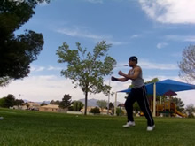
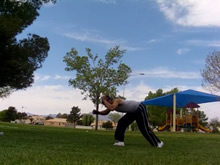

# Webster
Tucked Webster, Tucked Front Walkover

## Description

The Webster is a not so commonly used basic forwards flipping move. It jumps off one leg and lands on either one leg or two legs, depending on how skilled the performer is with it, or the performers intent. It's pretty simple actually. Some say it shares some relations with the Aerial, this is true to some extent, but they're still two different techniques.

Is this a Aerial Front Walkover or Front Aerial found in gymnastics? Nope. The Front Aerial or likeness found in gymnastics is done with the head arching back, with both legs totally straight, giving the body a very stretched looked throughout the move. This Webster is tucked, with the legs usually bent, and uhh yea, all of that. This Webster is found in Tricking, and also in Capoeira. The Webster is more useful in Tricking (though usually less aesthetic) because it's easy to land in a maneuverable position, and the leg you land on can be switched, allowing for more combination possibilities.

## Setup

* Step Forwards with Jumping Leg
* Lean Upper Body Over Leading Knee
* Prepare Arms to Swing

  

Don't worry about doing a huge run-up into this. If you're just learning this, you can take a nice brisk little jog with a small group of sets, or you can be more controlled by doing just a few little steps, or one. Get your arms open in front of you, ready to swing around!

Bend down to the ground a bit, step forwards in front of you with your jumping leg. You can start bending your upper body down at your discretion as well. This looks almost like a "going forwards" Aerial setup, only not turned sideways as much. You can either keep your eyesight upwards, or you can look down towards the ground like me. Your choice.

## Takeoff

* Swing Back Leg Up
* Jump Firmly Off Base Leg
* Swing Arms Up
* Tuck Chin In

  

Now the fun part. Jump up! Push straight up with with your leg, jump up!
Swing your back leg up behind you. Fast! Zing! Sling it up there.

You can keep looking at the ground if you want, or if you've kept looking forwards, do that.
What about the arms? When many people first learn this, to flip around, they swing their arms downwards and try throwing their leg up. No! Swing your arms around and upwards, mostly up. Your arms should already be well around enough from your setup anyways.

So, just think about ripping them UP as you jump. Remember, pull your arms up, think about jabbing your elbows up. Pull them into the sky hard. Do not swing them towards the ground, yank them up, even around then up if you need to.

## Flip Over

* Pull Upper Body Upwards
* Keep Pulling Leg Towards Ground
* Start Spotting in Front of You

  

This step mostly results from the takeoff. So there's not much to do here. However, between the takeoff for this move and this step, you're going to want to tuck your chin in hard. GRR HARD! As you rip your arms upwards, tuck your chin into your chest and think about looking at what's in front of you again. Rar! Aggressive! And there's not much to say really. Notice how short this guide is? That's because this trick is easy, even the good version.

## Land

* Pull Feet Together or One Foot at a Time

  

And we're at the landing already. Hurray! This is seemingly natural, just allow your feet to land. It's sorta like a Front Handspring. Now, if you've really pushed yourself upwards during the takeoff, and stretched your legs far apart during the takeoff, you should be able to land on one foot at a time easily. As you get more used to doing it well, it should become less forced, making the landing easier. Remember, the key to landing one leg at a time on this is to jump fast and flip over faster, which entails pulling the leg up behind you faster and tucking very fast. Don't worry about it at first, just get used to it.

Landing on one leg for this shows that you can do it well, it's usually less stressful, and who knows, maybe it opens up the possibility for carry-through combinations, yes?
And have fun!

