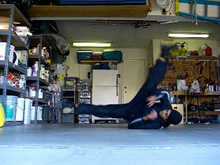

# Windmill

## Description

Windmills are an almost signature B-Boying power move. They are probably the most basic of power moves but are still quite powerful and fun to do. They involve rolling from your front onto your back using the momentum and force generated by your legs whirling around in an almost figure-8 type motion. They are great fun and soo important in learning more advanced power moves, because they provide the basis for learning how to swing your leg in a circular motion to create momentum to accomplish power moves.

## General Tips

<ul style="margin-top: 0px;">
<li>Rolling onto your upper back is much better, and easier, than rolling on your lower back.</li>
<li>Swing with legs straight for each swing, leading each swing with the foot.</li>
<li>Try to make each swing pass close by the ground, while simultaneously keeping the opposite leg higher in the air.
<ul><li>Keeping your legs straight as well as farther apart helps pull your hips and drive your body around in the way you need to.</li></ul></li>
<li>Lead swings far away from body, in a very circular matter.</li>
<li>You need to be able to pivot higher onto your arms/shoulders when rolling over to the front.</li>
<li>The collapse happens naturally when you start rotating your body from the initial position, just flow with it.</li>
</ul>

## Initial Setup Position

* Stab Base Elbow to Lower Stomach
* Spread Legs Behind
* Balance With Other Hand
* (Handglide Position)

I teach the Windmill to start in this position. Since you probably can't see me in my entirety, I will describe the setup to you. Arm that you will "collapse" on (if you're going clockwise, right, if you're going counter, left) slightly bent with the elbow tucked around the side of your lower stomach. Other arm just out there however for support. Legs <i>spread</i> slightly in the back. You don't have to have a massive spread, but they do need to be spread more than shoulder width apart. Well they don't NEED to be, but it helps.
>### Other Setups
>There are many other ways to enter windmills. One of these includes from things like coffee-grinders. Another is from that thing where they lean right on back and kick over to the front then roll around. Then there's variations of this setup, and from standing, etc. I'd say practice all these once you have decent mills. But trust me, learn them with this setup. It is the most efficient for a beginner.

## Turn and Collapse

* Lift Leading Leg Straight Up
* Rotate Body Outwards Slightly
* Allow Body to Collapse Base Elbow Onto Shoulder
* Hold Other Leg Back in Preparation

  

In my example slides/video I'm sorta rushing the setup haha, so I'll try to slow down the principles here for you.
### Leg Lift

First of all, the leading leg. In this case, since I'm going clockwise, it's my left leg. Right leg for counter. Anyways, which direction should you pull that leg? I find it most effective not to say to the back, front, side, or whatever. Just stick it UP. Just think about poking the sky with your toes, and through that move it in whatever direction relative to your body is necessary, as long as it goes in the absolute direction of upwards. Don't worry about it being straight until you're totally collapsed. As you can see, by the time I'm almost on my shoulder my leg is just about straight.
Lift your hips up with this, that's why your leg is lifting up really. Lifting your leg up keeps your hips up as your upper body goes down, and it turns you over.
### Collapse

Many make a huge deal over the collapse. I don't really, though it's quite important. What is the collapse? It's when your main supporting arm folds in so you can roll onto your shoulder smoothly, transitioning your momentum, instead of falling.
How should you do it? As you lift your lead leg up, bend your arm in backwards. Try to keep your elbow on your side, and fold your arm up against it.
### Watch Yourself

Keep careful note that your bottom leg that you're going to swing stays clooose to the floor, especially as your leading leg straightens. It's essential that you don't lift your swinging leg up with your other leg. This will take your leg off the path it's going to swing in for one, and for two the less spread your legs have, the less momentum you'll have.

>Get used to just lifting up and letting that collapse you. It's a crucial movement, so get used to doing it naturally and easily.

## Pull and Swing

* Hold High Leg Out Straight
* Swing Other Leg Straight, Low, and Circularly
* Roll Onto Upper Back

 

>Take a look at a pendulum, how does it get momentum?
>
>
>
><i>It doesn't swing directly inwards, that kills the momentum.</i> It swings around the outside!
>
>
>
>Do the same with your swing, swing it far away along the circular path for maximum momentum!

Here comes the swing. Briefly, hold your leading leg up in the air. You don't need to really pull it or swing it much anymore, just keep it up there. Try to make your toes point towards your head now.
You should start the swing at the end of the last step. And when it comes to the swing: Swing low to the ground. Swing it very low to the ground. In fact, try to draw a circle on the ground with the edge of your foot.
It's important to swing and draw that foot along the ground as far as you can until it's not physically possible, at this point, it will automatically start pull up in front of you more towards your face. Pull it in this circle, and from here you want to push it into the sky.
### Drills

Rushing into getting back up from the windmill is meaningless if you're doing these steps improperly. To that end, I recommend you practice all the steps up to this one; the setup, lift, collapse, swing, etc. When done properly, this should leave you spinning on your back. Practice these components of the skill until you can do them very well. Get a camera and carefully examine yourself. Make sure you're in total control of all your body parts, and are doing the proper motions with them.

>For now just practice lifting, collapsing, and then doing that into this step with the swing. Try to get the momentum to make you spin a little ways on your back, using the power of the swing.

## Back Swing

* Keep Rolling Up Onto Shoulder/Arms
* Carry Last Swinging Leg High Up
* Swing Back Leg Down and Straight
* Consciously Spreads Legs Apart

 

>I tell you to pull your leg straight down to the ground. Why?
>
><i>If you pull your leg down to the ground, it stretches far from you. While you do this, your hips are turning over. So we have two motions...</i>
>
>
>
>So we take those two motions and do them at the same time, combining them...
>
>
>
><b>This gives us the nice wide circular pendulum-like swing we need!</b>

Ok first of all, a continuation from the last step is to keep pushing your first swinging leg up into the sky, and holding it in it's current position. Alright?
This helps elevate your hips off the ground. Of course, you can do this too! How? Just by telling yourself, "Self, pull my hips off the ground." Get your hips high off the ground, curl them in to you, use those abs! Etc.
### Pull Your Back Leg to the Ground

Yup, I said it! Your first swinging leg is now finished swinging, and your first leading leg is ready to come around. So I tell you, swing it at the ground. Don't try to pull it behind you. Why?
Your other leg is pushing up, right? And your hips and body are turning over, right? So as you pull that leg up in that circle, to complete the circle, you have to drive that leg along the same path. By pulling towards the ground, you create lots of tension and force between your legs, which manifests as momentum. Seriously, pull that back leg to the ground as you pull your other one up, you'll be amazed at the results.

>Practice doing all the steps up to here and letting your feet come straight down and land. Technically, that's one full mill.

## Roll Over

* Continue Swing Around From Last Step
* Plant Arms Firmly On Ground as Pivot Point
* Use Momentum to Keep Hips and Legs Up High
* Optionally - Finish the Mill Here

This step starts during the previous one actually.
The motions of your legs in the past steps, along with lifting your hips up, will help turn you over. But how do you control this now?
Consciously think to, as you turn over, place your hands on the ground. You want to bend your arms a lot and keep your arms close to your body, generally around your chest. You don't want to put them lower, like towards your stomach, because your hips will be low and that will kill all of the momentum you've created. Put them on the ground, try to put them on the ground together, and the "higher" up you do this, the better.
Once your arms are on the ground, you can use this new anchor you've established to help lift your hips off the ground even more if you need.
>### Transitioning Into Higher Moves
>Ho ho, when it comes to moves where your hips are inherently higher, like going into Halos, Headspins, or whatever from this, you really need to make sure your arms are "re-stabbing" high. You want your elbows to be higher up on your body, around your chest, and if you need to get upright (upside down), you need to push with your arms, and move your upper body into the right position. Remember, now that your arms are holding the ground you can easily move your hips into whatever position, allowing for a variety of transitions.

>Before moving on to continuous mills, make sure you do all the steps up to here and get them good. That is one complete mill by itself.

## Continuation Swing

* Re-Collapse (Roll) Onto Shoulder and Upper Back
* Hold Last Swinging Leg Up
* Swing Other Leg Down Under (Again)

 

Now if you take the last step, you might see it looks like our original setup, but not as pretty, and with the arms in a weirder looking position holding us up, and with the hips and leg higher in the air.
At any rate, you just want to follow the same steps now, which should flow out easier since you have plentiful momentum.
The leading leg pulls up again, and the swinging leg sweeps low around in the semi-circle to the ground again. Good deal!
Let your arms fold in again, and try to roll as smoothly as possible onto your shoulder.
### Hard to Continue With a Swing?

One big reason it can be hard to swing your leg again is because your hips aren't high enough coming out of your first windmill. If your hips are low, your legs have no room for manipulation, and you won't be able to get as much of a spread in your legs subsequently. So, in the past couple steps, try to pull your hips into the air even higher, that sets you up for a nice second sweep.

## Second Mill

* Repeat the Windmill Technique

 

And now this mill continues just like the first one. Keep pulling your leg, stretch them apart, all that good stuff. As you start to get good at doing more than one mill, the later ones become easier from all the built up momentum, pretty neat huh?
Well, that's windmills for you. Go have fun and try it!

